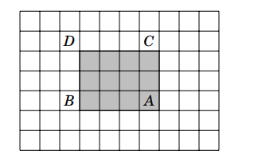

# Prefix Sum Tutorial for Sum Queries

## Introduction

Prefix Sum is a powerful technique used to answer range sum queries efficiently. Sum queries are queries to evaluate sum of all elements in a given range in an array. 

Instead of calculating the sum of elements again and again for every query, we preprocess the array once and store cumulative sums.

This reduces:

- Brute force query time: `O(n)`
- Prefix sum query time: `O(1)`

Preprocessing takes only `O(n)` time.

---

# 1D Prefix Sum

## Problem

Given an array:

```text
Index:  0 1 2 3 4 5 6 7
Array: [1 3 4 8 6 1 4 2]
```

We want to quickly find sums of subarrays like:

```text
sum(3,6) = 8 + 6 + 1 + 4
```

---

# Building the Prefix Sum Array

Define:

```text
prefix[i] = sum of elements from index 0 to i
```

So:

```text
prefix[0] = arr[0]
prefix[1] = arr[0] + arr[1]
prefix[2] = arr[0] + arr[1] + arr[2]
...
```

For the given array:

```text
Index:   0  1  2  3  4  5  6  7
Array:   1  3  4  8  6  1  4  2
Prefix:  1  4  8 16 22 23 27 29
```

---

# Formula for Range Sum

To calculate:

```text
sum(a,b)
```

We use:

\[
sum(a,b) = prefix[b] - prefix[a-1]
\]

Special case:

If `a = 0`, then:

\[
sum(0,b) = prefix[b]
\]

---

# Example

Find:

```text
sum(3,6)
```

From the prefix array:

```text
prefix[6] = 27
prefix[2] = 8
```

So:

\[
sum(3,6) = 27 - 8 = 19
\]

Which matches:

```text
8 + 6 + 1 + 4 = 19
```

---

# Why Prefix Sum Works

Observe:

```text
prefix[6] = 1+3+4+8+6+1+4
prefix[2] = 1+3+4
```

Subtracting removes unwanted elements:

```text
(1+3+4+8+6+1+4) - (1+3+4)
= 8+6+1+4
```

---

# 1D Prefix Sum Implementation (C++)

## Building Prefix Array

```cpp
vector<int> arr = {1,3,4,8,6,1,4,2};
int n = arr.size();

vector<int> prefix(n);

prefix[0] = arr[0];

for(int i = 1; i < n; i++) {
    prefix[i] = prefix[i-1] + arr[i];
}
```

---

## Range Sum Query

```cpp
int rangeSum(int l, int r, vector<int>& prefix) {

    if(l == 0)
        return prefix[r];

    return prefix[r] - prefix[l-1];
}
```

---

# Time Complexity

| Operation | Complexity |
|---|---|
| Build Prefix Sum | `O(n)` |
| Each Query | `O(1)` |

---

# 2D Prefix Sum

Prefix sums can also be extended to matrices.

This helps answer rectangle sum queries (queries to evaluate sum of elements in smaller rectangles) in `O(1)` time.

---

# 2D Prefix Sum Definition

Suppose:

```text
prefix[i][j]
```

stores the sum of all elements from:

```text
(0,0) to (i,j)
```

Meaning the rectangle from the upper-left corner.

---

# Rectangle Sum Query

Suppose we want the sum of a rectangle.

We use inclusion-exclusion:

\[
Answer = S(A) - S(B) - S(C) + S(D)
\]

Where:

- `S(A)` = entire large rectangle
- `S(B)` = remove upper unwanted part
- `S(C)` = remove left unwanted part
- `S(D)` = add overlap back

---

# Visual Understanding



Formula:

\[
sum = S(A) - S(B) - S(C) + S(D)
\]

---

# Building 2D Prefix Sum

## Formula
## prefix[i][j] = arr[i][j] + prefix[i-1][j] + prefix[i][j-1] - prefix[i-1][j-1]

Why subtract?

Because the overlap gets counted twice.

---

# 2D Prefix Sum Implementation (C++)

## Building the Prefix Matrix

```cpp
int n, m;

vector<vector<int>> arr(n, vector<int>(m));
vector<vector<int>> prefix(n, vector<int>(m));

for(int i = 0; i < n; i++) {

    for(int j = 0; j < m; j++) {

        prefix[i][j] = arr[i][j];

        if(i > 0)
            prefix[i][j] += prefix[i-1][j];

        if(j > 0)
            prefix[i][j] += prefix[i][j-1];

        if(i > 0 && j > 0)
            prefix[i][j] -= prefix[i-1][j-1];
    }
}
```

---

# 2D Range Sum Query

Suppose rectangle:

```text
(top,left) to (bottom,right)
```

Formula:

```cpp
int sum = prefix[bottom][right];

if(top > 0)
    sum -= prefix[top-1][right];

if(left > 0)
    sum -= prefix[bottom][left-1];

if(top > 0 && left > 0)
    sum += prefix[top-1][left-1];
```

---

# Time Complexity

| Operation | Complexity |
|---|---|
| Build 2D Prefix Sum | `O(n*m)` |
| Rectangle Query | `O(1)` |

---

# Common Uses of Prefix Sum

## 1D Applications

- Range sum queries
- Frequency counting
- Difference arrays
- Subarray problems
- Sliding window optimizations

---

## 2D Applications

- Matrix sum queries
- Image processing
- Grid problems
- Competitive programming rectangle queries

---

