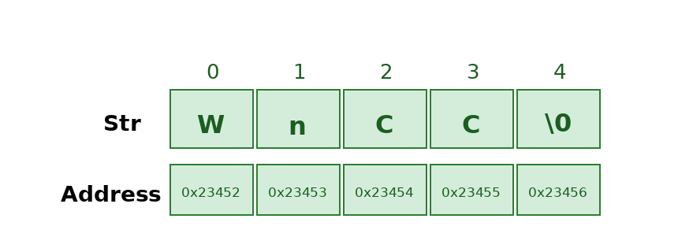

# String in Data Structure
A string is a sequence of characters. The following facts make string an interesting data structure.
Small set of elements. Unlike normal array, strings typically have smaller set of items. For example, lowercase English alphabet has only 26 characters. ASCII has only 256 characters.

The differences between a character array and a string are, a string is terminated with a special character ‘\0’ and strings are typically immutable in most of the programming languages like Java, Python and JavaScript. Below are some examples of strings:

## How Strings are represented in Memory?
### In Cpp:-
Supports both C-style character arrays and the std::string class, which provides built-in functions for string manipulation, they are mutable in cpp.

### In Python:-
Strings are immutable and can be declared using single, double, or triple quotes, making them flexible for multi-line text handling.
### In Java:-
Strings are immutable objects of the String class, meaning their values cannot be modified once assigned.



## Are Strings Mutable in Different Languages?
In C/C++, string literals (assigned to pointers) are immutable.
In C++, string objects are mutable.
In Python, Java and JavaScript, strings are immutable.

### In Cpp:-
```
#include <iostream>
using namespace std;

int main() {
    const char* str = "Hello, world!";
    str[0] = 'h';  // Error : Assignment to read only
    cout << str;
    return 0;
}
```
### In Java:-
```
import java.io.*;

class  Define{
  
    public static void main(String[] args) {      
        String s1 = "java";     
        s1.concat(" rules");
      
        // s1 is not changed because strings are
        // immutable
        System.out.println("s1 refers to " + s1);
    }
}
```
### In Python:-
```
s = "WnCC"

# This will cause a error 
# because strings are immutable
s[1] = 'f'  

print(s)
```

## How to Declare Strings in various languages?
### In Cpp:-
```
#include <iostream>
#include <string>
using namespace std;

int main()
{

    // Declare and initialize the string
    string str1 = "Welcome to the DSA Bootcamp";//We can define strings only in Double quotes

    // Initialization by raw string
    string str2("WnCC");

    // Print string
    cout << str1 << endl << str2;

    return 0;
}
```

### In Java:-
```
import java.io.*;
import java.lang.*;

class Test {
    public static void main(String[] args)
    {
        // Declare String without using new operator
        String s = "WnCC";

        // Prints the String.
        System.out.println("String s = " + s);

        // Declare String using new operator
        String s1 = new String("WnCC");

        // Prints the String.
        System.out.println("String s1 = " + s1);
    }
}
```

### In Python:-
```
# Creating a String
# with single Quotes
String1 = 'Welcome to the DSA Bootcamp'
print("String with the use of Single Quotes: ")
print(String1)

# Creating a String
# with double Quotes
String2 = "WnCC"
print("\nString with the use of Double Quotes: ")
print(String2)

# Creating a String
# with triple Quotes
String3 = '''Welcome to Learner's Space'''
print("\nString with the use of Triple Quotes: ")
print(String3)

# Creating String with triple
# Quotes allows multiple lines
String4 = '''Coders
            Together
            Strong'''
print("\nCreating a multiline String: ")
print(String4)
```


## Accessing Characters
### In Cpp:-
```
#include <iostream>
#include <string>
using namespace std;

int main() {
    string str = "Hello World";

    // Access using index operator []
    cout << "First character: " << str[0] << endl;
    cout << "Fifth character: " << str[4] << endl;

    // Access using at()
    cout << "Character at index 6: " << str.at(6) << endl;

    return 0;
}
```
### In Java:-
```
public class Main {
    public static void main(String[] args) {
        String str = "Hello World";

        // Access using charAt()
        System.out.println("First character: " + str.charAt(0));
        System.out.println("Fifth character: " + str.charAt(4));

        // Access using charAt() (equivalent to at())
        System.out.println("Character at index 6: " + str.charAt(6));
    }
}
```
### In Python:-
```
str = "Hello World"

# Access using index operator []
print("First character:", str[0])
print("Fifth character:", str[4])

# Access using index (equivalent to at())
print("Character at index 6:", str[6])
```

## Basic Operations
### Length of a String
Given a string s, the task is to find the length of the string.

### In Cpp:-
```
#include <iostream>
#include <cstring>
using namespace std;

int main()
{
    string s = "WnCC";
    cout << s.size() << endl;
    return 0;
}
```
### In Java:-
```
import java.io.*;

class GfG {
    public static void main(String[] args)
    {
        String s = "WnCC";
        System.out.println(s.length());
    }
}
```
### In Python:-
```
s = "WnCC"
print(len(s))
```

### Check for Same
Given two strings, check if these two strings are identical(same) or not

### In Cpp:-
```
#include <iostream>
using namespace std;

bool areStringsSame(string s1, string s2) {
    return s1 == s2;
}
int main(){
    string s1 = "abc";
    string s2 = "abcd";
  
    if (areStringsSame(s1, s2)) {
        cout << "Yes" << endl;
    }
    else {
        cout << "No" << endl;
    }
    return 0;
}
```
### In Java:-
```
public class Check {
    
    public static boolean areStringsSame(String s1, String s2) {
        return s1.equals(s2);
    }
    public static void main(String[] args) {
        String s1 = "abc";
        String s2 = "abcd";

        if (areStringsSame(s1, s2)) {
            System.out.println("Yes");
        } else {
            System.out.println("No");
        }
    }
}
```
### In Python:-
```
def areStringsSame(s1, s2):
    return s1 == s2

if __name__ == '__main__':
    s1 = "abc"
    s2 = "abcd"

    if areStringsSame(s1, s2):
        print("Yes")
    else:
        print("No")
```

### Search a Character
Given a character ch and a string s, the task is to find the index of the first occurrence of the character in the string. If the character is not present in the string, return -1.

### In Cpp:-
```
#include <iostream>
using namespace std;

int findChar(string &s, char ch) {
    int n = s.length();
    for (int i = 0; i < n; i++) {

        // If the current character is equal to ch,
        // return the current index
        if (s[i] == ch)
            return i;
    }

    // If we did not find any occurrence of ch,
    // return -1
    return -1;
}

int main() {
    string s = "DSA Bootcamp";
    char ch = 'k';

    cout << findChar(s, ch) << "\n";
    return 0;
}
```
### In Java:-
```
class Find {
  
    static int findChar(String s, char ch) {
        int n = s.length();
        for (int i = 0; i < n; i++) {
          
            // If the current character is equal to ch, 
            // return the current index
            if (s.charAt(i) == ch)
                return i;
        }

        // If we did not find any occurrence of ch,
        // return -1
        return -1;
    }

    public static void main(String[] args) {
        String s = "DSA Bootcamp";
        char ch = 'k';
      
        System.out.println(findChar(s, ch));
    }
}
```
### In Python:-
```
def findChar(s, ch):
    n = len(s)
    for i in range(n):
      
        # If the current character is equal to ch, 
        # return the current index
        if s[i] == ch:
            return i

    # If we did not find any occurrence of ch,
    # return -1
    return -1

if __name__ == "__main__":
    s = "DSA Bootcamp"
    ch = 'k'
  
    print(findChar(s, ch))
```

### Insert a Character
Given a string s, a character c and an integer position pos, the task is to insert the character c into the string s at the specified position pos

### In Cpp:-
```
#include <bits/stdc++.h>
using namespace std;

string insertChar(string &s, char c, int pos) {
  
    // Insert character at specified position pos
    s.insert(s.begin() + pos, c);
  	return s;
}

int main() {
    string s = "WnCC";
    cout << insertChar(s, 'A', 3);
    return 0;
}
```
### In Java:-
```
// Java program to insert a character at specific
// position using Built in functions

class Insert{
    static String insertChar(StringBuilder sb, char c, int pos) {
      
        // Insert character at specified position
        sb.insert(pos, c);
        return sb.toString();
    }

    public static void main(String[] args) {
        StringBuilder sb = new StringBuilder("WnCC");
        System.out.println(insertChar(sb, 'A', 3));
    }
}
```
### In Python:-
```
# Python program to insert a character at specific
# position using Built in functions

def insertChar(s, c, pos):
  
    # Insert character at specified position
    return s[:pos] + c + s[pos:]

s = "WnCC"
print(insertChar(s, 'A', 3))
```

### Remove a Character
Given a string s and a position pos, remove the character at the given position.

### In Cpp:-
```
#include <bits/stdc++.h>
using namespace std;

string removeCharAtPosition(string s, int pos) {
    if (pos < 0 || pos >= s.length()) {
        return s;
    }
    s.erase(pos, 1);
    return s;
}

int main() {
    string s = "abcde";
    int pos = 1;
    cout << "Output: " << removeCharAtPosition(s, pos) << endl; 
    return 0;
}
```

### In Java:-
```
class Delete{
	public static void main(String[] args)
	{

		// create a StringBuilder object
		// with a String pass as parameter
		StringBuilder s
			= new StringBuilder("abcde");


		// print string after removal of Character
        // at index 1 
		System.out.println("Output: " + s.deleteCharAt(1));
	}
}
```
### In Python:-
```
def remove_char_at_position(s, pos):
    if pos < 0 or pos >= len(s):
        return s
    return s[:pos] + s[pos+1:]

s = "abcde"
pos = 1
print("Output:", remove_char_at_position(s, pos))
```

### Remove all occurrences
Given a string s and a character c, remove all the occurrences of the character in the string.

### In Cpp:-
```
#include <algorithm>
#include <iostream>
using namespace std;

int main() {
    string s = "ababca";
    char c = 'a';
  
    // Remove all occurrences of 'c' from 's'
    s.erase(remove(s.begin(), s.end(), c), s.end());

    cout << s;
    return 0;
}
```
### In Java:-
```
import java.util.*;

public class RemoveAll{
    public static void main(String[] args) {
        String s = "ababca";
        char c = 'a';
        
        // Remove all occurrences of 'c' from 's'
        s = s.replace(String.valueOf(c), "");

        System.out.println(s);
    }
}
```
### In Python:-
```
def main():
    s = "ababca"
    c = 'a'

    # Remove all occurrences of 'c' from 's'
    s = s.replace(c, '')

    print(s)

if __name__ == "__main__":
    main()
```

### Concatenating Two Strings
String concatenation is the process of joining two strings end-to-end to form a single string.

### In Cpp:-
```
#include <iostream>
#include <string>

using namespace std;

int main() {
    string s1 = "Hello ";
    string s2 = "WnCC";
    
    // Concatenating the strings
    string res = s1 + s2;
    
    cout << res << endl;
    return 0;
}
```
### In Java:-
```
public class Concatenation{
    public static void main(String[] args) {
        String s1 = "Hello ";
        String s2 = "WnCC";
        
        // Concatenating the strings
        String res = s1 + s2;
        
        System.out.println(res);
    }
}
```
### In Python:-
```
def main():
    s1 = "Hello "
    s2 = "WnCC"

    # Concatenating the strings
    res = s1 + s2
    print(res)

if __name__ == "__main__":
    main()
```

### Reverse a string
Given a string s, reverse the string. Reversing a string means rearranging the characters such that the first character becomes the last, the second character becomes second last and so on.

### In Cpp:-
```
#include <iostream>
#include <string>
using namespace std;

string reverseString(string& s) {
    string res;
  
  	// Traverse on s in backward direction
  	// and add each charecter to a new string
    for (int i = s.size() - 1; i >= 0; i--) {
        res += s[i];
    }
    return res;
}

int main() {
    string s = "abdcfe";
    string res = reverseString(s);
    cout << res;
    return 0;
}
```
### In Java:-
```
class Reverse{
    static String reverseString(String s) {
        StringBuilder res = new StringBuilder();
  
        // Traverse on s in backward direction
        // and add each character to a new string
        for (int i = s.length() - 1; i >= 0; i--) {
            res.append(s.charAt(i));
        }
        return res.toString();
    }

    public static void main(String[] args) {
        String s = "abdcfe";
        String res = reverseString(s);
        System.out.print(res);
    }
}
```
### In Python:-
```
def reverseString(s):
    res = []
  
    # Traverse on s in backward direction
    # and add each character to the list
    for i in range(len(s) - 1, -1, -1):
        res.append(s[i])

    # Convert list back to string
    return ''.join(res)

if __name__ == "__main__":
    s = "abdcfe"
    print(reverseString(s))
```

### Rotate a String:-
Rotating a string means shifting its characters to the left or right by a specified number of positions while maintaining the order of the remaining characters. The characters that move past the boundary wrap around to the other side.

[Rotate a String|GeeksforGeeks](https://www.geeksforgeeks.org/dsa/left-rotation-right-rotation-string-2/)

### Generate all Substrings:-
Given a string s, containing lowercase alphabetical characters. The task is to print all non-empty substrings of the given string.

[Generate all Substrings|GeeksforGeeks](https://www.geeksforgeeks.org/dsa/program-print-substrings-given-string/)

### Check for Palindrome:-
Checking for a palindrome means determining whether a string reads the same forward and backward. A palindrome remains unchanged when reversed, making it a useful concept in text processing, algorithms, and number theory.

[Check for Palindrome|GeeksforGeeks](https://www.geeksforgeeks.org/dsa/palindrome-string/)

## Resources:-
[Strings in C++](https://www.geeksforgeeks.org/cpp/strings-in-cpp/)

[Strings in Java](https://www.geeksforgeeks.org/java/strings-in-java/)

[Strings in Python](https://www.geeksforgeeks.org/python/python-string/)