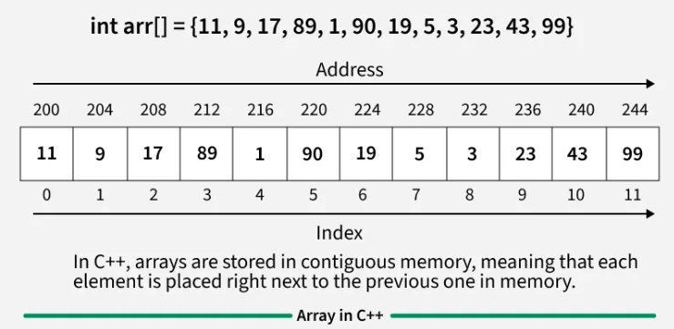
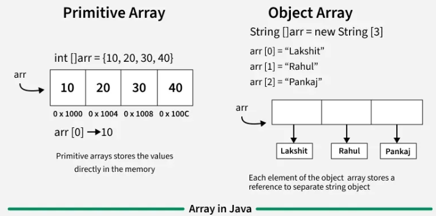
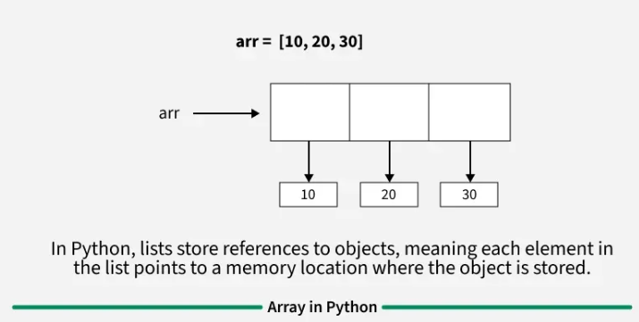
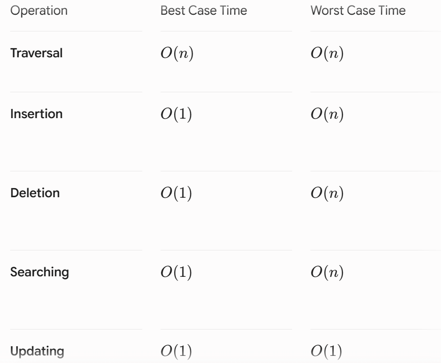
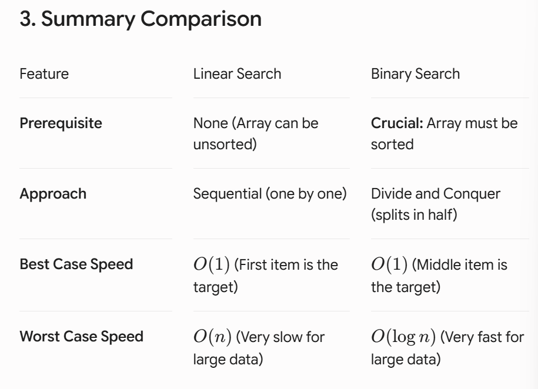

# Arrays

An array is a fundamental and linear data structure that stores items at contiguous locations.

### Advantages of Using arrays
1. **Random Access**: $i$-th item can be accessed in $O(1)$ Time as we have the base address and every item or reference is of same size.
2. **Cache Friendliness**: Since items / references are stored at contiguous locations, we get the advantage of locality of reference.

### Memory representation of Array
In an array, all the elements or their references are stored in contiguous memory locations. This allows for efficient access and manipulation of elements.

### Internal Memory Allocation for Array in Diff Languages

#### 1. C++




#### 2. Java




#### 3. Python



---

## Basic Operations on Arrays

### 1. Traversal
Going through the array from start to finish, one by one, to see, print, or use every single item.

#### C++
```cpp
int main() {
    int arr[] = {1, 2, 3, 4, 5};
    int n = sizeof(arr) / sizeof(arr[0]);
    cout << "Linear Traversal: ";
    for(int i = 0; i < n; i++) {
        cout << arr[i] << " ";
    }
    cout << endl;
    return 0;
}
```

#### Java
```java
public class Main {
    public static void main(String[] args) {
        int[] arr = {1, 2, 3, 4, 5};
        int n = arr.length;
        System.out.print("Linear Traversal: ");
        for(int i = 0; i < n; i++) {
            System.out.print(arr[i] + " ");
        }
        System.out.println();
    }
}
```

#### Python
```python
arr = [1, 2, 3, 4, 5]
print("Linear Traversal: ", end=" ")
for i in arr:
    print(i, end=" ")
print()
```

**Time Complexity:** $O(n)$ because if you have $n$ items, you have to look at all $n$ of them.

---

### 2. Insertion (Adding an Element)
Adding a new item to the array. This can happen at the beginning, end, or middle.

> **NOTE:** If you insert an item at the beginning or middle, you have to manually slide all the subsequent items over to the right to make room.

#### C++
```cpp
int main() {
    int n = 4;
    vector<int> arr = {10, 20, 30, 40, 0};
    int ele = 50;
    int pos = 2;
    cout << "Array before insertion\n";
    for (int i = 0; i < n; i++)
        cout << arr[i] << " ";
        
    // Shifting elements to the right
    for(int i = n; i >= pos; i--)
        arr[i] = arr[i - 1];
        
    // Insert the new element at index pos - 1
    arr[pos - 1] = ele;
    
    cout << "\nArray after insertion\n";
    for (int i = 0; i <= n; i++)
        cout << arr[i] << " ";
    return 0;
}
```

#### Java
```java
import java.util.Arrays;

class Insertion {
    public static void main(String[] args) {
        int n = 4;
        int[] arr = {10, 20, 30, 40, 0};
        int ele = 50;
        int pos = 2;
        System.out.println("Array before insertion");
        for (int i = 0; i < n; i++)
            System.out.print(arr[i] + " ");
            
        // Shifting elements to the right
        for (int i = n; i >= pos; i--)
            arr[i] = arr[i - 1];
            
        // Insert the new element at index pos - 1
        arr[pos - 1] = ele;
        
        System.out.println("\nArray after insertion");
        for (int i = 0; i <= n; i++)
            System.out.print(arr[i] + " ");
    }
}
```

#### Python
```python
if __name__ == "__main__":
    n = 4
    arr = [10, 20, 30, 40, 0]
    ele = 50
    pos = 2
    print("Array before insertion")
    for i in range(n):
        print(arr[i], end=' ')
        
    # Shifting elements to the right
    for i in range(n, pos - 1, -1):
        arr[i] = arr[i - 1]
        
    # Insert the new element at index pos - 1
    arr[pos - 1] = ele
    
    print("\nArray after insertion")
    for i in range(n + 1):
        print(arr[i], end=' ')
```

**Time Complexity:** $O(1)$ if adding to the end, but $O(n)$ if adding to the middle/beginning because of the shifting involved.

---

### 3. Deletion
Removing an item from a specific position in the array.

> **NOTE:** Just like insertion, deleting leaves a "hole". The computer has to slide all the remaining items to the left to close the gap.

#### C++
```cpp
int main() {
    vector<int> arr = { 10, 20, 30, 40 };
    int pos = 2;
    cout << "Array before deletion\n";
    for (int i = 0; i < arr.size(); i++)
        cout << arr[i] << " ";
        
    // Delete the element at the given position
    arr.erase(arr.begin() + pos - 1);
    
    cout << "\nArray after deletion\n";
    for (int i = 0; i < arr.size(); i++)
        cout << arr[i] << " ";
    return 0;
}
```

#### Java
```java
import java.util.ArrayList;
import java.util.Arrays;

class Delete {
    public static void main(String[] args) {
        ArrayList<Integer> arr = new ArrayList<Integer>(Arrays.asList(10, 20, 30, 40));
        int pos = 2;
        System.out.println("Array before deletion");
        for (int i = 0; i < arr.size(); i++)
            System.out.print(arr.get(i) + " ");
            
        // Delete the element at the specified position
        arr.remove(pos - 1);
        
        System.out.println("\nArray after deletion");
        for (int i = 0; i < arr.size(); i++)
            System.out.print(arr.get(i) + " ");
    }
}
```

#### Python
```python
arr = [10, 20, 30, 40]
pos = 2
print("Array before deletion")
for num in arr:
    print(num, end=" ")
    
# Delete the element at the specified position
del arr[pos - 1]

print("\nArray after deletion")
for num in arr:
    print(num, end=" ")
```

**Time Complexity:** $O(n)$ because shifting items to fill the empty space takes longer as the array grows.

---

### 4. Updating
Changing the value of an existing element at a specific index.

#### C++
```cpp
int arr[5] = {1, 2, 3, 4, 5};
arr[0] = 8; // Updates index 0 to 8
```

#### Java
```java
int[] arr = {2, 4, 8};
arr[0] = 90; // Updates index 0 to 90
```

#### Python
```python
prices = [10, 20, 30, 40]
# Change the price at index 2 (the third item, 30) to 99
prices[2] = 99
print(prices)
# Result: [10, 20, 99, 40]
```

### Summary of Operation Complexities



---

## Searching operations in an Array
Once you have data stored in an array, the next logical step is figuring out how to find a specific piece of information. The GeeksforGeeks guides highlight two primary methods.

### Method A: Linear Search (The Brute Force Approach)
Linear search is exactly what it sounds like: a straight line. You start at the very first element (index 0) and check each item one by one until you find what you are looking for, or until you reach the end.

* **How it works**: "Are you the number 5? No. Are you the number 5? No. Are you the number 5? Yes!"
* **When to use it**: When your array is small, or more importantly, when your array is unsorted (the items are in random order).
* **Efficiency**: It is slow for large datasets. If the array has 1 million items, and the one you want is at the very end, you have to make 1 million checks ($O(n)$ time complexity).
* **For More Info**: [ Linear Search](https://geeksforgeeks.org)

### Method B: Binary Search (The Smart Approach)
Binary search is a much faster method, but it has one strict rule: The array **MUST** be sorted first (e.g., lowest to highest).

Think of a dictionary. If you are looking for the word "Monkey," you don't read from page one. You open the book to the middle. If you land on "P", you know "M" comes before it, so you tear the book in half, throw away the back half, and open the remaining half to the middle again. You repeat this until you find the word.

* **How it works**: It compares the target value to the middle element of the array. If they aren't equal, it eliminates the half in which the target cannot lie, and repeats the search on the remaining half.
* **When to use it**: When dealing with large, sorted datasets.
* **Efficiency**: Extremely fast. Even with 1 million items, it takes a maximum of only about 20 checks to find your target ($O(\log n)$ time complexity).
* **For More Info**: [ Binary Search](https://geeksforgeeks.org)

### Search Summary Comparison


---

## Important Patterns In Arrays
1. [Sliding Window](https://geeksforgeeks.org)
2. [Two Pointers](https://geeksforgeeks.org)
3. [Prefix Sum](https://takeuforward.org)
4. [Kadane's Algorithm](https://geeksforgeeks.org)
5. [ Fast & Slow Pointers (Tortoise and Hare)](https://educative.io)
(this pattern and its application will also be covered during Linked list)
---

## Other Resources for Additional Learning Purpose
* [Application of Arrays](https://geeksforgeeks.org)
* [ Vector in C++ STL](https://geeksforgeeks.org)
* [Deletion of all occurrence of an element](https://geeksforgeeks.org)
* [ Top 50 Problems of Arrays](https://geeksforgeeks.org)
(before attempting these problems you can first attempt the problems given in the Repo and after completion of those you can attempt these problems also for more learning)

>You can make an excel sheet of all the problems that you solve across this bootcamp along with the problem Link and what approach did you use in that particular question, this would be helpful for you during revision.
