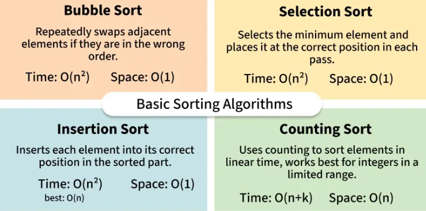

# Sorting Algorithms

A Sorting Algorithm is used to rearrange a given array or list of elements in an order.
(While learning diff types of sorting algorithms below we would recommend you that after reading the theory of one sorting algo. Try to dry run it yourself once on 2-3 examples and trying to code it yourself before seeing the code and then you can cross check with the actual code.Also once u finish all the algorithms make a one pg short note of it writing the main concept of each Algo, its Time Space complexities and some when to apply it. Also at the end of some articles there are few short QnA you can go through them for better understanding)

## Types of Sorting Techniques

There are various sorting algorithms used in data structures. The following two types of sorting algorithms can be broadly classified:
1. **Comparison-based:** We compare the elements in a comparison-based sorting algorithm
2. **Non-comparison-based:** We do not compare the elements in a non-comparison-based sorting algorithm

## Basic Sorting Algorithms

There are mainly 4 types of basic sorting Algorithms
1. Bubble Sort
2. Insertion Sort
3. Selection Sort
4. Counter Sort

### 1. Bubble Sort
* [Theory](https://www.geeksforgeeks.org/dsa/bubble-sort-algorithm/)
* [T.C and S.C Analysis]( https://www.geeksforgeeks.org/dsa/time-and-space-complexity-analysis-of-bubble-sort/)

### 2. Insertion Sort
* [Theory](https://www.geeksforgeeks.org/dsa/insertion-sort-algorithm/)
* [T.C and S.C Analysis](https://www.geeksforgeeks.org/dsa/time-and-space-complexity-of-insertion-sort-algorithm/)

### 3. Selection Sort
* [Theory](https://www.geeksforgeeks.org/dsa/selection-sort-algorithm-2/)
* **T.C and S.C Analysis** - 
  * **Time Complexity:** O(n2) ,as there are two nested loops:
    * ● One loop to select an element of Array one by one = O(n)
    * ● Another loop to compare that element with every other Array element = O(n)
    * ● Therefore overall complexity = O(n) * O(n) = O(n*n) = O(n2)
  * **Auxiliary Space:** O(1) as the only extra memory used is for temporary variables.

### 4. Counter Sort
* [Theory](https://www.geeksforgeeks.org/dsa/counting-sort/)
* **T.C and S.C Analysis** - 
  * **Time Complexity:** O(N+M) in all cases, where N and M are the size of inputArray[] and countArray[] respectively.
  * **Auxiliary Space:** O(N+M), where N and M are the space taken by outputArray[] and countArray[] respectively.

## Advance Sorting Algorithms

* Merge Sort
* Quick Sort

### 1. Merge Sort
* [Theory](https://www.geeksforgeeks.org/dsa/merge-sort/)

### 2. Quick Sort
* [Theory](https://www.geeksforgeeks.org/dsa/quick-sort-algorithm/)
* [T.C and S.C Analysis](https://www.geeksforgeeks.org/dsa/)time-and-space-complexity-analysis-of-quick-sort/

Mainly All the Important Sorting Algos are covered above Below are some Extra sorting Algorithms for your learning:
* [Cycle Sort](https://www.geeksforgeeks.org/dsa/cycle-sort/)
* [Heap Sort](https://www.geeksforgeeks.org/dsa/heap-sort/)
* [Radix Sort](https://www.geeksforgeeks.org/dsa/radix-sort/)

## Other Resources for Additional Learning Purpose

* [Sorting in STL (C++)](https://www.geeksforgeeks.org/cpp/sort-c-stl/)
* [Java](https://www.geeksforgeeks.org/java/arrays-sort-in-java/)
* [Sorting a Rotated Sorted Array](https://www.geeksforgeeks.org/dsa/sort-rotated-sorted-array/)
* [Searching in a Rotated Sorted Array](https://leetcode.com/problems/search-in-rotated-sorted-array/description/)
* [Imp Interview Questions on Sorting Algorithms]( https://www.geeksforgeeks.org/dsa/commonly-asked-data-structure-interview-questions-on-sorting/)
* [Top Practice Practice Problems on Sorting Algorithms]( https://www.geeksforgeeks.org/dsa/top-sorting-interview-questions-and-problems/)
