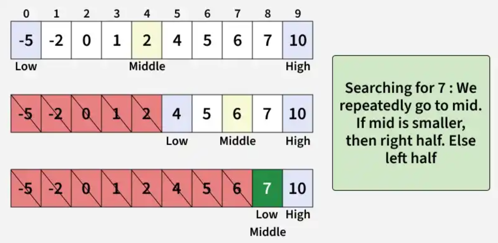
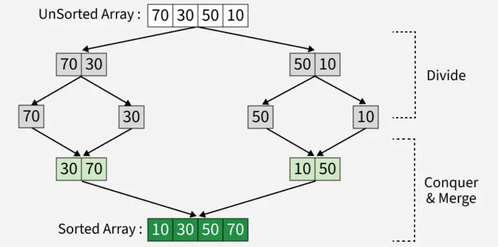
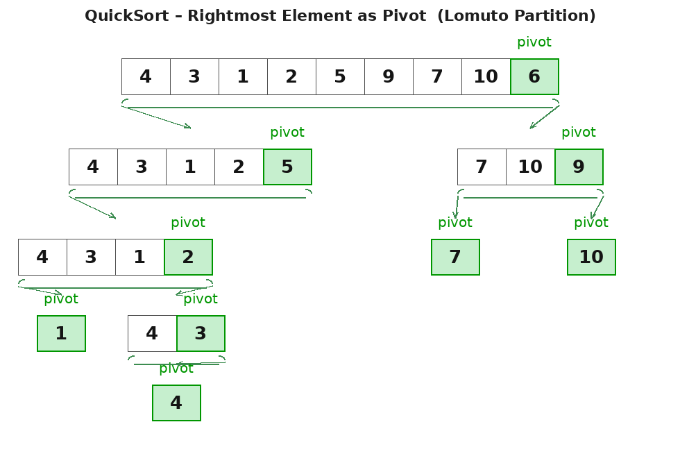
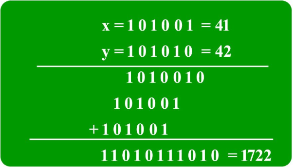
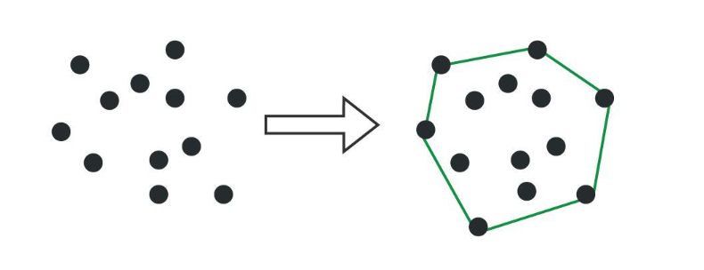

# Divide And Conquer
Divide and Conquer Algorithm is a problem-solving technique used to solve problems by dividing the main problem into subproblems, solving them individually and then merging them to find solution to the original problem. Divide and Conquer is mainly useful when we divide a problem into independent subproblems. 

## Divide
>Break down the original problem into smaller subproblems.
>Each subproblem should represent a part of the overall problem.
>The goal is to divide the problem until no further division is possible.

## Conquer
>Solve each of the smaller subproblems individually.
>If a subproblem is small enough (often referred to as the “base case”), we solve it directly without further recursion.
>The goal is to find solutions for these subproblems independently.

## Merge
>Combine the sub-problems to get the final solution of the whole problem.
>Once the smaller subproblems are solved, we recursively combine their solutions to get the solution of larger problem.
>The goal is to formulate a solution for the original problem by merging the results from the subproblems.

## Complexity Analysis of Divide and Conquer Algorithm
T(n) = aT(n/b) + f(n), where n = size of input a = number of subproblems in the recursion n/b = size of each subproblem. All subproblems are assumed to have the same size. f(n) = cost of the work done outside the recursive call, which includes the cost of dividing the problem and cost of merging the solutions.

## Standard Algorithms
### Binary Search
Binary Search is a searching algorithm that operates on a sorted or monotonic search space, repeatedly dividing it into halves to find a target value or optimal answer in logarithmic time O(log N).

Let the end point's index be low(= 0) and high(arr[len]-1).
Compute the mid(= low + (high-low)/2) after every iteration.
Compare arr[mid] with the target number(x)
if target > arr[mid] -> choose the right side of mid in the array => low = mid+1.
if target < arr[mid] -> choose the left side of mid in the array => high = mid-1.
For every choosen subarray check arr[mid] == target.
This process is continued until the key is found or the total search space is exhausted


### In Cpp:-
```
int binarySearch(vector<int> &arr, int x) {
    int low = 0;
    int high = arr.size() - 1;
    while (low <= high) {
        int mid = low + (high - low) / 2;

        if (arr[mid] == x)
            return mid;

        if (arr[mid] < x)
            low = mid + 1;

        else
            high = mid - 1;
    }
    return -1;
}
```
### In Java:-
```
    static int binarySearch(int arr[], int x) {
        int low = 0, high = arr.length - 1;
        while (low <= high) {
            int mid = low + (high - low) / 2;

            if (arr[mid] == x)
                return mid;

            if (arr[mid] < x)
                low = mid + 1;

            else
                high = mid - 1;
        }
        return -1;
    }
```
### In Python:-
```
def binarySearch(arr, x):
    low = 0
    high = len(arr) - 1
    while low <= high:

        mid = low + (high - low) / 2

        if arr[mid] == x:
            return mid

        elif arr[mid] < x:
            low = mid + 1

        else:
            high = mid - 1

    return -1
```

### Merge Sort
Merge Sort works by recursively dividing the input array into two halves, recursively sorting the two halves and finally merging them back together to obtain the sorted array.

Divide the list or array recursively into two halves until it can no more be divided.
Each subarray is sorted individually using the merge sort algorithm.
The sorted subarrays are merged back together in sorted order. The process continues until all elements from both subarrays have been merged.


### In Cpp:-
```
void merge(vector<int>& arr, int left, int mid, int right){
                         
    int n1 = mid - left + 1;
    int n2 = right - mid;

    vector<int> L(n1), R(n2);

    for (int i = 0; i < n1; i++)
        L[i] = arr[left + i];
    for (int j = 0; j < n2; j++)
        R[j] = arr[mid + 1 + j];

    int i = 0, j = 0;
    int k = left;

    while (i < n1 && j < n2) {
        if (L[i] <= R[j]) {
            arr[k] = L[i];
            i++;
        }
        else {
            arr[k] = R[j];
            j++;
        }
        k++;
    }

    while (i < n1) {
        arr[k] = L[i];
        i++;
        k++;
    }

    while (j < n2) {
        arr[k] = R[j];
        j++;
        k++;
    }
}

void mergeSort(vector<int>& arr, int left, int right){
    
    if (left >= right)
        return;

    int mid = left + (right - left) / 2;
    mergeSort(arr, left, mid);
    mergeSort(arr, mid + 1, right);
    merge(arr, left, mid, right);
}
```
### In Java:-
```
 static void merge(int arr[], int l, int m, int r){
     
        int n1 = m - l + 1;
        int n2 = r - m;

        int L[] = new int[n1];
        int R[] = new int[n2];

        for (int i = 0; i < n1; ++i)
            L[i] = arr[l + i];
        for (int j = 0; j < n2; ++j)
            R[j] = arr[m + 1 + j];

        int i = 0, j = 0;

        int k = l;
        while (i < n1 && j < n2) {
            if (L[i] <= R[j]) {
                arr[k] = L[i];
                i++;
            }
            else {
                arr[k] = R[j];
                j++;
            }
            k++;
        }

        while (i < n1) {
            arr[k] = L[i];
            i++;
            k++;
        }
        
        while (j < n2) {
            arr[k] = R[j];
            j++;
            k++;
        }
    }

    static void mergeSort(int arr[], int l, int r){
        if (l < r) {
            int m = l + (r - l) / 2;

            mergeSort(arr, l, m);
            mergeSort(arr, m + 1, r);

            merge(arr, l, m, r);
        }
    }
```
### In Python:-
```
def merge(arr, left, mid, right):
    n1 = mid - left + 1
    n2 = right - mid

    L = [0] * n1
    R = [0] * n2

    for i in range(n1):
        L[i] = arr[left + i]
    for j in range(n2):
        R[j] = arr[mid + 1 + j]
        
    i = 0  
    j = 0  
    k = left  

    while i < n1 and j < n2:
        if L[i] <= R[j]:
            arr[k] = L[i]
            i += 1
        else:
            arr[k] = R[j]
            j += 1
        k += 1

    while i < n1:
        arr[k] = L[i]
        i += 1
        k += 1

    while j < n2:
        arr[k] = R[j]
        j += 1
        k += 1

def mergeSort(arr, left, right):
    if left < right:
        mid = (left + right) // 2

        mergeSort(arr, left, mid)
        mergeSort(arr, mid + 1, right)
        merge(arr, left, mid, right)
```

### Quick Sort
QuickSort is a sorting algorithm that picks an element as a pivot and partitions the given array around the picked pivot by placing the pivot in its correct position in the sorted array.

There are mainly three steps in the algorithm:

Choose a Pivot: Select an element from the array as the pivot. The choice of pivot can vary (e.g., first element, last element, random element, or median).
Partition the Array: Re arrange the array around the pivot. After partitioning, all elements smaller than the pivot will be on its left, and all elements greater than the pivot will be on its right.(It can be done using Naive Partition, Lomuto Partition, Hoare's Partition)
Recursively Call: Recursively apply the same process to the two partitioned sub-arrays.
Base Case: The recursion stops when there is only one element left in the sub-array, as a single element is already sorted.

Here we are discussing Lomuto Partition Algorithm and the rightmost element being the pivot

### In Cpp:-
```
int partition(vector<int>& arr, int low, int high) {
 
    int pivot = arr[high];

    int i = low - 1;

    for (int j = low; j <= high - 1; j++) {
        if (arr[j] < pivot) {
            i++;
            swap(arr[i], arr[j]);
        }
    }
    swap(arr[i + 1], arr[high]);  
    return i + 1;
}

void quickSort(vector<int>& arr, int low, int high) {
  
    if (low < high) {
      
        int pi = partition(arr, low, high);

        quickSort(arr, low, pi - 1);
        quickSort(arr, pi + 1, high);
    }
}
```
### In Java:-
```
 static int partition(int[] arr, int low, int high) {
       
        int pivot = arr[high];

        int i = low - 1;

        for (int j = low; j <= high - 1; j++) {
            if (arr[j] < pivot) {
                i++;
                swap(arr, i, j);
            }
        }
        swap(arr, i + 1, high);  
        return i + 1;
    }

    static void swap(int[] arr, int i, int j) {
        int temp = arr[i];
        arr[i] = arr[j];
        arr[j] = temp;
    }

    static void quickSort(int[] arr, int low, int high) {
        if (low < high) {
            
            int pi = partition(arr, low, high);

            quickSort(arr, low, pi - 1);
            quickSort(arr, pi + 1, high);
        }
    }
```
### In Python:-
```
def partition(arr, low, high):
    
    pivot = arr[high]
    
    i = low - 1
    
    for j in range(low, high):
        if arr[j] < pivot:
            i += 1
            swap(arr, i, j)
   
    swap(arr, i + 1, high)
    return i + 1

def swap(arr, i, j):
    arr[i], arr[j] = arr[j], arr[i]

def quickSort(arr, low, high):
    if low < high:
   
        pi = partition(arr, low, high)
        
        quickSort(arr, low, pi - 1)
        quickSort(arr, pi + 1, high)
```

### Calculate pow(a, n)
Given two numbers b(base) and e(exponent), calculate the value of b^e. Done using for loop by multiplying e times the new number pow with the original number b.

### In Cpp:-
```
double power(double b, int e) {

    double pow = 1;

    for (int i = 0; i < abs(e); i++) 
        pow = pow * b;
  	
  	if (e < 0)
      	return 1.0/pow;

    return pow;
}
```
### In Java:-
```
   static double power(double b, int e) {
        double pow = 1;

        for (int i = 0; i < Math.abs(e); i++) 
            pow = pow * b;

        if (e < 0)
            return 1 / pow;

        return pow;
    }
```
### In Python:-
```
def power(b, e):
    pow = 1

    for i in range(abs(e)):
        pow = pow * b

    if e < 0:
        return 1 / pow

    return pow
```

### Strassen’s Matrix Multiplication
Given two matrices mat1[][] of size n × m and mat2[][] of size m × q, find their matrix product, where the resulting matrix has dimensions n × q
### In Cpp:-
```
vector<vector<int>> multiply(vector<vector<int>> &mat1, vector<vector<int>> &mat2) {
    int n = mat1.size(), m = mat1[0].size(), q = mat2[0].size();        

    vector<vector<int>> res(n, vector<int>(q, 0));

    for (int i = 0; i < n; i++) {
        for (int j = 0; j < q; j++) {
            for (int k = 0; k < m; k++) {
                res[i][j] += mat1[i][k] * mat2[k][j];
            }
        }
    }
    return res;
}
```
### In Java:-
```
static ArrayList<ArrayList<Integer>> multiply(int[][] mat1, int[][] mat2) {
        int n = mat1.length;
        int m = mat1[0].length;
        int q = mat2[0].length;

        ArrayList<ArrayList<Integer>> res = new ArrayList<>();
        for (int i = 0; i < n; i++) {
            ArrayList<Integer> row = new ArrayList<>(Collections.nCopies(q, 0));
            res.add(row);
        }

        for (int i = 0; i < n; i++) {
            for (int j = 0; j < q; j++) {
                for (int k = 0; k < m; k++) {
                    int val = res.get(i).get(j) + mat1[i][k] * mat2[k][j];
                    res.get(i).set(j, val);
                }
            }
        }
        return res;
    }
```
### In Python:-
```
def multiply(mat1, mat2):
    n = len(mat1)
    m = len(mat1[0])
    q = len(mat2[0])

    res = [[0 for _ in range(q)] for _ in range(n)]

    for i in range(n):
        for j in range(q):
            for k in range(m):
                res[i][j] += mat1[i][k] * mat2[k][j]
    return res
```

## NOTE:-
You might find the upcoming 3 algos a bit intimidating but don't get disheartened, look at it multiple times and u will conquer it!!

Also peoople who are just starting to learn DSA might skip it for now and come again later to conquer it!!

### Karatsuba algorithm for fast multiplication
Given two binary strings that represent value of two integers, find the product of two strings.
We will understand this using an example, Consider if the first bit string is X = "1100" and second bit string is Y = "1010", output should be 120.
### Step-1:- Split the two strings X and Y into left and right half
X = "1100"  →  Xl = "11"   Xr = "00" => X = Xl × 2^(n/2)  +  Xr
Y = "1010"  →  Yl = "10"   Yr = "10" => X = Xl × 2^(n/2)  +  Xr
### Step-2:- Karatsuba's trick 
Compute only these 3 products:
P1 = Xl × Yl
P2 = Xr × Yr
P3 = (Xl + Xr) × (Yl + Yr)
Then you will notice:
P3 - P1 - P2  =  (Xl+Xr)(Yl+Yr) - Xl×Yl - Xr×Yr
              =  Xl×Yr + Xr×Yl        <= the middle terms
### Step-3:- Combine to get the final answer
X × Y = P1 × 2^(2×sh)  +  (P3 - P1 - P2) × 2^sh  +  P2
          (left chunk)     (middle cross terms)      (right chunk)
### Step-4:- Recurssion
P1, P2, P3 are themselves multiplications of half-sized strings, so apply the same algorithm recursively



[Code in Cpp/Java/Python](https://www.geeksforgeeks.org/dsa/karatsuba-algorithm-for-fast-multiplication-using-divide-and-conquer-algorithm/)

### Convex Hull
In computational geometry, a convex hull is the smallest convex polygon that contains a given set of points. 

1. Sort points by x-coordinate.
2. Split into left and right halves recursively.
3. Base case (≤5 points) → use brute force: check every pair of points; if all other points lie on one side of that line, it's a hull edge.
4. Merge the two sub-hulls by finding two tangent lines:
Upper tangent — line touching both hulls from above
Lower tangent — line touching both hulls from below
5. Build final hull by tracing from upper tangent → around left hull → lower tangent → around right hull.
6. Sort anti-clockwise (used in brute force step) via angle from centroid.

[Code in Cpp/Java/Python](https://www.geeksforgeeks.org/dsa/convex-hull-using-divide-and-conquer-algorithm/)

### Quickhull Algorithm for Convex Hull
1. Find extremes — get leftmost (min_x) and rightmost (max_x) points. Done in printHull().
2. Split into two sides — call quickHull() twice with side = 1 (above line) and side = -1 (below line).
3. Find farthest point — in quickHull(), scan all points on the given side and pick the one with max distance from the line. Done via lineDist().
4. Base case — if no point found on that side, the two endpoints are hull points → hull.insert(p1); hull.insert(p2).
5. Recurse — the farthest point a[ind] forms a triangle with p1, p2. Recurse on the two outer edges of this triangle:
a[ind] => p1
a[ind] => p2
6. Print hull — stored in a set<iPair> 
[Code in Cpp/Java/Python](https://www.geeksforgeeks.org/dsa/quickhull-algorithm-convex-hull/)

## Resoures
[Divide abd Conquer](https://www.geeksforgeeks.org/dsa/divide-and-conquer/)