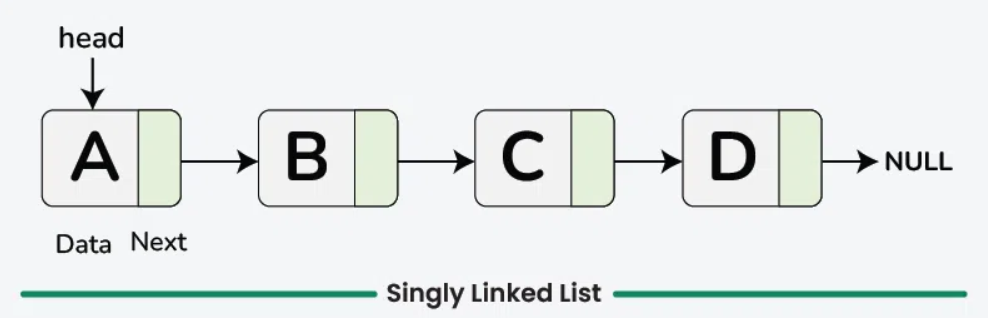

# Linked List

---

## What is a Linked List?

A **linked list** is a linear data structure in which elements, referred to as **nodes**, are stored at non-contiguous memory locations and connected through **pointers**.

Unlike arrays, which occupy **sequential memory**, each node in a linked list holds two components:

1. **Data** – The value or information stored in the node.
2. **Pointer/Link** – A reference to the **next node** in the sequence (and optionally, the previous node).

---

## Types of Linked Lists

### 1. Singly Linked List

Each node in a singly linked list contains two parts: the data and a pointer to the next node. Nodes are linked in a single direction, forming a sequential chain from the head to the last node, whose pointer is set to null.



### 2. Doubly Linked List

A doubly linked list extends the singly linked list by adding a second pointer. Each node therefore holds three fields:

- Data
- A pointer to the next node (`next`)
- A pointer to the previous node (`prev`)

This allows traversal in both directions.

### 3. Circular Linked List

**Circular Singly:** Each node has a single `next` pointer, but unlike a singly linked list, the last node points back to the first node, forming a closed loop. Traversal is possible in one direction only.

**Circular Doubly:** Each node has both `prev` and `next` pointers. The last node's `next` points to the first node, and the first node's `prev` points to the last node, enabling bidirectional circular traversal.

---

## Creating a Linked List

### Step 1: Define the Node Structure

**Java**
```java
class Node {
    int data;
    Node next;

    Node(int data) {
        this.data = data;
        this.next = null;
    }
}
```

**Python**
```python
class Node:
    def __init__(self, data):
        self.data = data  # Value stored in the node
        self.next = None  # Reference to the next node
```

**C++**
```cpp
struct Node {
    int data;
    Node* next;

    Node(int data) {
        this->data = data;
        this->next = nullptr;
    }
};
```

---

### Step 2: Initialise the Head of the List

**Java**
```java
Node head = null;
```

**Python**
```python
head = None
```

**C++**
```cpp
Node* head = nullptr;
```

---

### Step 3: Create New Nodes

New nodes are instantiated and assigned a value. In languages with manual memory management (such as C++), nodes are dynamically allocated using the `new` keyword.

**Java**
```java
Node newNode = new Node(10);
```

**Python**
```python
new_node = Node(10)
```

**C++**
```cpp
Node* newNode = new Node(10);
```

---

### Step 4: Link the Nodes

If the list already contains nodes, traverse to the last node and update its `next` pointer to reference the new node.

**Java**
```java
// Assuming head is already set
Node temp = head;
while (temp.next != null) {
    temp = temp.next;
}
temp.next = newNode;
```

**Python**
```python
temp = head
while temp.next is not None:
    temp = temp.next
temp.next = new_node
```

**C++**
```cpp
Node* temp = head;
while (temp->next != nullptr) {
    temp = temp->next;
}
temp->next = newNode;
```

For complete implementation reference, see: [How to create a Linked List | GeeksforGeeks](https://www.geeksforgeeks.org/how-to-create-linked-list/)

---

## Traversal

### Step-by-Step Algorithm

1. Initialise a temporary pointer to the head node.
2. If the pointer is null, the list is empty — return.
3. While the pointer is not null, print the current node's data and advance the pointer to the next node.

**Java**
```java
Node temp = head;
while (temp != null) {
    System.out.print(temp.data + " ");
    temp = temp.next;
}
```

**Python**
```python
temp = head
while temp is not None:
    print(temp.data, end=" ")
    temp = temp.next
```

**C++**
```cpp
Node* temp = head;
while (temp != nullptr) {
    cout << temp->data << " ";
    temp = temp->next;
}
```

**Time Complexity:** O(n), where n is the number of nodes.  
**Auxiliary Space:** O(1)

Reference: [Traversal of Singly Linked List | GeeksforGeeks](https://www.geeksforgeeks.org/traversal-of-singly-linked-list/)

---

## Inserting a Node

Insertion can be performed at various positions in the list:

- At the beginning
- Before a given node
- After a given node
- At a specific position
- At the end

### 1. Insert at the Beginning

A new node is created and its `next` pointer is set to the current head. The head is then updated to the new node.

**Java**
```java
Node newNode = new Node(data);
newNode.next = head;
head = newNode;
```

**Python**
```python
new_node = Node(data)
new_node.next = head
head = new_node
```

**C++**
```cpp
Node* newNode = new Node(data);
newNode->next = head;
head = newNode;
```

---

### 2. Insert After a Given Node

Locate the target node, set the new node's `next` to the target's `next`, then update the target's `next` to the new node.

**Java**
```java
Node newNode = new Node(data);
newNode.next = prevNode.next;
prevNode.next = newNode;
```

**Python**
```python
new_node = Node(data)
new_node.next = prev_node.next
prev_node.next = new_node
```

**C++**
```cpp
Node* newNode = new Node(data);
newNode->next = prevNode->next;
prevNode->next = newNode;
```

---

### 3. Insert Before a Given Node

Traverse the list while tracking both the current and previous nodes. Once the target node is found, link the previous node to the new node, and point the new node to the target.

**Java**
```java
Node newNode = new Node(data);
newNode.next = targetNode;
prevNode.next = newNode;
```

**Python**
```python
new_node = Node(data)
new_node.next = target_node
prev_node.next = new_node
```

**C++**
```cpp
Node* newNode = new Node(data);
newNode->next = targetNode;
prevNode->next = newNode;
```

---

### 4. Insert at a Specific Position

Traverse to position − 1, then adjust the pointers so the new node is placed at the desired index.

**Java**
```java
Node temp = head;
for (int i = 1; i < position - 1; i++) {
    temp = temp.next;
}
Node newNode = new Node(data);
newNode.next = temp.next;
temp.next = newNode;
```

**Python**
```python
temp = head
for i in range(1, position - 1):
    temp = temp.next
new_node = Node(data)
new_node.next = temp.next
temp.next = new_node
```

**C++**
```cpp
Node* temp = head;
for (int i = 1; i < position - 1; i++) {
    temp = temp->next;
}
Node* newNode = new Node(data);
newNode->next = temp->next;
temp->next = newNode;
```

---

### 5. Insert at the End

Traverse the entire list to reach the last node, then update its `next` pointer to the new node.

**Java**
```java
Node temp = head;
while (temp.next != null) {
    temp = temp.next;
}
temp.next = new Node(data);
```

**Python**
```python
temp = head
while temp.next is not None:
    temp = temp.next
temp.next = Node(data)
```

**C++**
```cpp
Node* temp = head;
while (temp->next != nullptr) {
    temp = temp->next;
}
temp->next = new Node(data);
```

Reference: [Insertion in Linked List | GeeksforGeeks](https://www.geeksforgeeks.org/insertion-in-linked-list/)

---

## Deleting a Node

Deletion can be performed at the following positions:

- At the beginning
- At a specific position
- At the end

### 1. Deletion at the Beginning

Verify the list is not empty, then move the head pointer to the second node. In C++, free the memory of the original head node.

**Java**
```java
if (head != null) {
    head = head.next;
}
```

**Python**
```python
if head is not None:
    head = head.next
```

**C++**
```cpp
if (head != nullptr) {
    Node* temp = head;
    head = head->next;
    delete temp;
}
```

---

### 2. Deletion at a Specific Position

Validate the position, traverse to the node just before the target (position n − 1), update its `next` pointer to skip the target node, then deallocate the target.

**Java**
```java
Node temp = head;
for (int i = 1; i < position - 1; i++) {
    temp = temp.next;
}
temp.next = temp.next.next;
```

**Python**
```python
temp = head
for i in range(1, position - 1):
    temp = temp.next
temp.next = temp.next.next
```

**C++**
```cpp
Node* temp = head;
for (int i = 1; i < position - 1; i++) {
    temp = temp->next;
}
Node* toDelete = temp->next;
temp->next = toDelete->next;
delete toDelete;
```

---

### 3. Deletion at the End

If the list is empty, return. If only one node exists, set the head to null. Otherwise, traverse to the second-last node, set its `next` to null, and free the last node.

**Java**
```java
if (head.next == null) {
    head = null;
} else {
    Node temp = head;
    while (temp.next.next != null) {
        temp = temp.next;
    }
    temp.next = null;
}
```

**Python**
```python
if head.next is None:
    head = None
else:
    temp = head
    while temp.next.next is not None:
        temp = temp.next
    temp.next = None
```

**C++**
```cpp
if (head->next == nullptr) {
    delete head;
    head = nullptr;
} else {
    Node* temp = head;
    while (temp->next->next != nullptr) {
        temp = temp->next;
    }
    delete temp->next;
    temp->next = nullptr;
}
```

---

## Resources

Visualise linked list operations interactively:  
[Linked List (Single, Doubly) – VisuAlgo](https://visualgo.net/en/list)

Additional reading:  
[Singly Linked List Tutorial | GeeksforGeeks](https://www.geeksforgeeks.org/singly-linked-list-tutorial/)  
[Doubly Linked List Tutorial | GeeksforGeeks](https://www.geeksforgeeks.org/doubly-linked-list/)  
[Introduction to Circular Linked List | GeeksforGeeks](https://www.geeksforgeeks.org/circular-linked-list/)

---

## Practice Problems

### Easy

1. [Reverse Linked List – LeetCode](https://leetcode.com/problems/reverse-linked-list/) | [Solution](https://www.geeksforgeeks.org/reverse-a-linked-list/)
2. [Remove Linked List Elements – LeetCode](https://leetcode.com/problems/remove-linked-list-elements/description/) | [Solution](https://www.geeksforgeeks.org/delete-occurrences-given-key-linked-list/)
3. [Merge Two Sorted Lists – LeetCode](https://leetcode.com/problems/merge-two-sorted-lists/) | [Solution](https://www.geeksforgeeks.org/merge-two-sorted-linked-lists/)
4. [Linked List Cycle II – LeetCode](https://leetcode.com/problems/linked-list-cycle-ii/) | [Solution](https://www.geeksforgeeks.org/find-length-of-loop-in-linked-list/)
5. [Palindrome Linked List – LeetCode](https://leetcode.com/problems/palindrome-linked-list/) | [Solution](https://www.geeksforgeeks.org/function-to-check-if-a-singly-linked-list-is-palindrome/)
6. [Intersection of Two Linked Lists – LeetCode](https://leetcode.com/problems/intersection-of-two-linked-lists/description/) | [Solution](https://www.geeksforgeeks.org/write-a-function-to-get-the-intersection-point-of-two-linked-lists/)
7. [Middle of the Linked List – LeetCode](https://leetcode.com/problems/middle-of-the-linked-list/description/) | [Solution](https://www.geeksforgeeks.org/write-a-c-function-to-print-the-middle-of-the-linked-list/)

### Medium

1. [Odd Even Linked List – LeetCode](https://leetcode.com/problems/odd-even-linked-list/description/) | [Solution](https://www.geeksforgeeks.org/segregate-even-and-odd-elements-in-a-linked-list/)
2. [Add Two Numbers – LeetCode](https://leetcode.com/problems/add-two-numbers/description/) | [Solution](https://www.geeksforgeeks.org/add-two-numbers-represented-by-linked-list/)
3. [Remove Nth Node From End of List – LeetCode](https://leetcode.com/problems/remove-nth-node-from-end-of-list/description/) | [Solution](https://www.geeksforgeeks.org/delete-nth-node-from-the-end-of-the-given-linked-list/)
4. [Rotate List – LeetCode](https://leetcode.com/problems/rotate-list/description/) | [Solution](https://www.geeksforgeeks.org/rotate-a-linked-list/)
5. [Sort List – LeetCode](https://leetcode.com/problems/sort-list/description/) | [Solution](https://www.geeksforgeeks.org/sorting-a-singly-linked-list/)

### Hard

1. [Reverse Nodes in k-Group – LeetCode](https://leetcode.com/problems/reverse-nodes-in-k-group/) | [Solution](https://www.geeksforgeeks.org/reverse-a-linked-list-in-groups-of-given-size/)
2. [Merge k Sorted Lists – LeetCode](https://leetcode.com/problems/merge-k-sorted-lists/description/) | [Solution](https://www.geeksforgeeks.org/merge-k-sorted-linked-lists/)
3. [LFU Cache – LeetCode](https://leetcode.com/problems/lfu-cache/description/) | [Solution](https://www.geeksforgeeks.org/lru-cache-implementation/)
