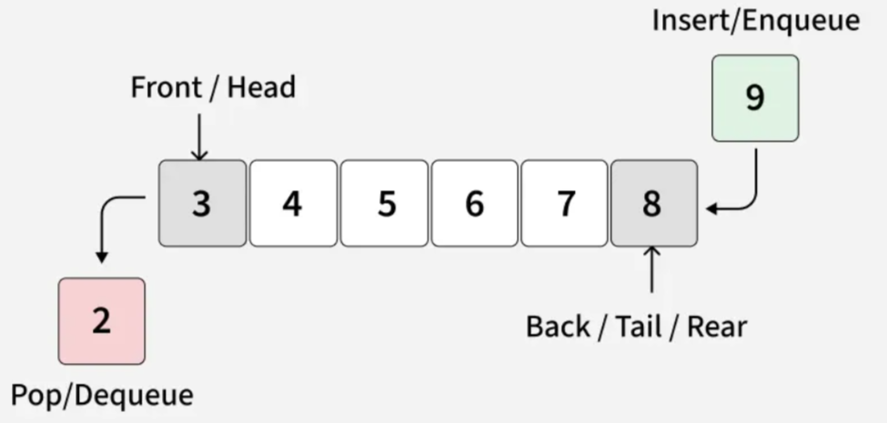

# Queue Data Structure

## What is a Queue?

A Queue stores elements in the order they arrive — the first element added is the first one removed. Think of a line of people waiting to buy tickets: the first person in line is the first person served.



> **FIFO vs FCFS** — two names for the same idea. FIFO (First In First Out) describes the data structure. FCFS (First Come First Served) describes the real-world analogy.

---

## Operations

| Operation | STL name | Description | Time Complexity |
|-----------|----------|-------------|-----------------|
| Enqueue | `push()` | Insert element at the rear | O(1) |
| Dequeue | `pop()` | Remove element from the front | O(1) |
| Front | `front()` | Return front element without removing | O(1) |
| Is empty | `empty()` | Return true if queue has no elements | O(1) |
| Size | `size()` | Return number of elements | O(1) |

Refer [Queue in STL](https://github.com/wncc/DSA-Bootcamp-2026/tree/main/Week-1/03-STL) for built-in usage.
This file focuses on how a queue is built from scratch.

---

## Implementation

### Using an Array (Fixed Queue)

We maintain:
- A fixed-size array `arr[]` to store the elements
- A variable `size` to track the current number of elements
- A variable `capacity` to represent the maximum number of elements

Enqueue appends to the rear (`arr[size]`); dequeue shifts all elements left by one — making dequeue O(n). This is exactly why the **Circular Queue** exists (see below).

**C++**
```cpp
class myQueue {

    int* arr;       // array to store queue elements
    int capacity;   // maximum number of elements the queue can hold
    int size;       // current number of elements in the queue

public:
    myQueue(int c) {
        capacity = c;
        arr = new int[capacity];
        size = 0;   // queue is empty initially
    }

    bool isEmpty() {// Check if queue is empty
        return size == 0;
    }

    bool isFull() {// Check if queue is full
        return size == capacity;
    }

    // Adds an element x at the rear of the queue
    void enqueue(int x) {
        if (isFull()) {
            cout << "Queue is full!\n";
            return;
        }
        arr[size] = x;   // insert at current rear position
        size++;          // expand the queue
    }

    // Removes the front element by shifting all elements one step left — O(n)
    void dequeue() {
        if (isEmpty()) {
            cout << "Queue is empty!\n";
            return;
        }
        for (int i = 1; i < size; i++) {
            arr[i - 1] = arr[i];   // shift each element one position left
        }
        size--;   // shrink the queue
    }

    // Returns the front element without removing it
    int getFront() {
        if (isEmpty()) {
            cout << "Queue is empty!\n";
            return -1;
        }
        return arr[0];   // front is always at index 0
    }

    // Returns the last element without removing it
    int getRear() {
        if (isEmpty()) {
            cout << "Queue is empty!\n";
            return -1;
        }
        return arr[size - 1];   // rear is always at index size-1
    }
};
```

**Java**
```java
class myQueue {
    private int[] arr;       // array to store queue elements
    private int capacity;    // maximum number of elements the queue can hold
    private int size;        // current number of elements in the queue

    public myQueue(int capacity) {
        this.capacity = capacity;
        arr = new int[capacity];
        size = 0;   // queue is empty initially
    }

    public boolean isEmpty() {// Check if queue is empty
        return size == 0;
    }

    public boolean isFull() {// Check if queue is full
        return size == capacity;
    }

    // Adds an element x at the rear of the queue
    public void enqueue(int x) {
        if (isFull()) {
            System.out.println("Queue is full!");
            return;
        }
        arr[size] = x;   // insert at current rear position
        size++;          // expand the queue
    }

    // Removes the front element by shifting all elements one step left — O(n)
    public void dequeue() {
        if (isEmpty()) {
            System.out.println("Queue is empty!");
            return;
        }
        for (int i = 1; i < size; i++) {
            arr[i - 1] = arr[i];   // shift each element one position left
        }
        size--;   // shrink the queue
    }

    // Returns the front element without removing it
    public int getFront() {
        if (isEmpty()) {
            System.out.println("Queue is empty!");
            return -1;
        }
        return arr[0];   // front is always at index 0
    }

    // Returns the last element without removing it
    public int getRear() {
        if (isEmpty()) {
            System.out.println("Queue is empty!");
            return -1;
        }
        return arr[size - 1];   // rear is always at index size-1
    }
}
```

**Python**
```python
class myQueue:
    def __init__(self, capacity):
        self.capacity = capacity      # maximum number of elements the queue can hold
        self.arr = [0] * capacity     # array to store queue elements
        self.size = 0                 # queue is empty initially

    def isEmpty(self):# Check if queue is empty
        return self.size == 0

    def isFull(self):# Check if queue is full
        return self.size == self.capacity

    # Adds an element x at the rear of the queue
    def enqueue(self, x):
        if self.isFull():
            print("Queue is full!")
            return
        self.arr[self.size] = x   # insert at current rear position
        self.size += 1            # expand the queue

    # Removes the front element by shifting all elements one step left — O(n)
    def dequeue(self):
        if self.isEmpty():
            print("Queue is empty!")
            return
        for i in range(1, self.size):
            self.arr[i - 1] = self.arr[i]   # shift each element one position left
        self.size -= 1   # shrink the queue

    # Returns the front element without removing it
    def getFront(self):
        if self.isEmpty():
            print("Queue is empty!")
            return -1
        return self.arr[0]   # front is always at index 0

    # Returns the last element without removing it
    def getRear(self):
        if self.isEmpty():
            print("Queue is empty!")
            return -1
        return self.arr[self.size - 1]   # rear is always at index size-1
```

---

### Using a Linked List (Variable Queue)

We maintain:
- A `Node` structure containing `data` and a `next` pointer
- A `front` pointer — always points to the first node (dequeue happens here)
- A `rear` pointer — always points to the last node (enqueue happens here)
- Both enqueue and dequeue are O(1) and the queue grows dynamically — no fixed size limit

**C++**
```cpp
class Node {// Node class
public:
    int data;
    Node* next;

    Node(int x) {
        data = x;
        next = nullptr;   // new node has no next initially
    }
};
// Queue class
class myQueue {
private:
    Node* front;    // points to the front node (dequeue happens here)
    Node* rear;     // points to the rear node (enqueue happens here)
    int currSize;   // tracks current number of elements

public:
    myQueue() {
        currSize = 0;
        front = rear = nullptr;   // empty queue — both pointers are null
    }

    bool isEmpty() {
        return front == nullptr;// Check if queue is empty
    }

    // Adds a new node at the rear of the queue
    void enqueue(int x) {
        Node* node = new Node(x);
        if (isEmpty()) {
            front = rear = node;   // first element — both front and rear point to it
        } else {
            rear->next = node;     // link new node after current rear
            rear = node;           // move rear pointer to new node
        }
        currSize++;
    }

    // Removes the front node and returns its value
    int dequeue() {
        if (isEmpty()) {
            cout << "Queue Underflow\n";
            return -1;
        }
        Node* temp = front;                       // save current front to delete later
        int val = temp->data;
        front = front->next;                      // move front pointer to next node
        if (front == nullptr) rear = nullptr;     // queue is now empty — reset rear too
        delete temp;                              // free memory — important in C++
        currSize--;
        return val;
    }

    // Returns the front element without removing it
    int getFront() {
        if (isEmpty()) {
            cout << "Queue is empty\n";
            return -1;
        }
        return front->data;   // just return without removing
    }

    // Returns current size in O(1) using the counter
    int size() {
        return currSize;
    }
};
```

**Java**
```java
// Node class
class Node {
    int data;
    Node next;

    Node(int x) {
        data = x;
        next = null;   // new node has no next initially
    }
}

// Queue class
class myQueue {
    private Node front;    // points to the front node (dequeue happens here)
    private Node rear;     // points to the rear node (enqueue happens here)
    private int currSize;  // tracks current number of elements

    public myQueue() {
        currSize = 0;
        front = rear = null;   // empty queue — both pointers are null
    }

    public boolean isEmpty() {// Check if queue is empty
        return front == null;
    }

    // Adds a new node at the rear of the queue
    public void enqueue(int x) {
        Node node = new Node(x);
        if (isEmpty()) {
            front = rear = node;   // first element — both front and rear point to it
        } else {
            rear.next = node;      // link new node after current rear
            rear = node;           // move rear pointer to new node
        }
        currSize++;
    }

    // Removes the front node and returns its value
    public int dequeue() {
        if (isEmpty()) {
            System.out.println("Queue Underflow");
            return -1;
        }
        int val = front.data;
        front = front.next;              // move front pointer to next node
        if (front == null) rear = null;  // queue is now empty — reset rear too
        currSize--;
        return val;   // Java GC handles memory cleanup automatically
    }

    // Returns the front element without removing it
    public int getFront() {
        if (isEmpty()) {
            System.out.println("Queue is empty");
            return -1;
        }
        return front.data;   // just return without removing
    }

    // Returns current size in O(1) using the counter
    public int size() {
        return currSize;
    }
}
```

**Python**
```python
# Node class
class Node:
    def __init__(self, x):
        self.data = x
        self.next = None   # new node has no next initially

# Queue class
class myQueue:
    def __init__(self):
        self.front = None     # points to the front node (dequeue happens here)
        self.rear = None      # points to the rear node (enqueue happens here)
        self.currSize = 0     # tracks current number of elements

    def isEmpty(self):# Check if queue is empty
        return self.front is None

    # Adds a new node at the rear of the queue
    def enqueue(self, x):
        new_node = Node(x)
        if self.isEmpty():
            self.front = self.rear = new_node   # first element — both pointers point to it
        else:
            self.rear.next = new_node           # link new node after current rear
            self.rear = new_node                # move rear pointer to new node
        self.currSize += 1

    # Removes the front node and returns its value
    def dequeue(self):
        if self.isEmpty():
            print("Queue Underflow")
            return -1
        val = self.front.data
        self.front = self.front.next        # move front pointer to next node
        if self.front is None:
            self.rear = None                # queue is now empty — reset rear too
        self.currSize -= 1                  # Python GC handles memory cleanup
        return val

    # Returns the front element without removing it
    def getFront(self):
        if self.isEmpty():
            print("Queue is empty")
            return -1
        return self.front.data   # just return without removing

    # Returns current size in O(1) using the counter
    def size(self):
        return self.currSize
```

---

## Array vs Linked List

| | Array-based | Linked List-based |
|---|---|---|
| Dequeue cost | O(n) — shifts all elements | O(1) — just move front pointer |
| Enqueue cost | O(1) | O(1) |
| Memory | Contiguous, cache-friendly | Scattered, pointer overhead |
| Max size | Fixed at creation | Dynamic |
| **Use when** | Size known, use circular variant | Size unpredictable |

---

## Circular Queue

The array implementation above has one problem: dequeue shifts every element left — O(n). A **Circular Queue** fixes this by using `front` and `rear` indices that wrap around using modulo arithmetic (`% capacity`). Both enqueue and dequeue become O(1) and no memory is wasted.

- [Circular Queue using Arrays — GeeksforGeeks](https://www.geeksforgeeks.org/dsa/introduction-and-array-implementation-of-queue/)
- [Circular Queue using Linked List — GeeksforGeeks](https://www.geeksforgeeks.org/dsa/circular-linked-list-implementation-of-circular-queue/)

---

## Resources

- [Queue Data Structure — GeeksforGeeks](https://www.geeksforgeeks.org/dsa/queue-data-structure/)

- [Queue using Array — GeeksforGeeks](https://www.geeksforgeeks.org/dsa/array-implementation-of-queue-simple/)

- [Queue using Linked List — GeeksforGeeks](https://www.geeksforgeeks.org/dsa/queue-linked-list-implementation/)

