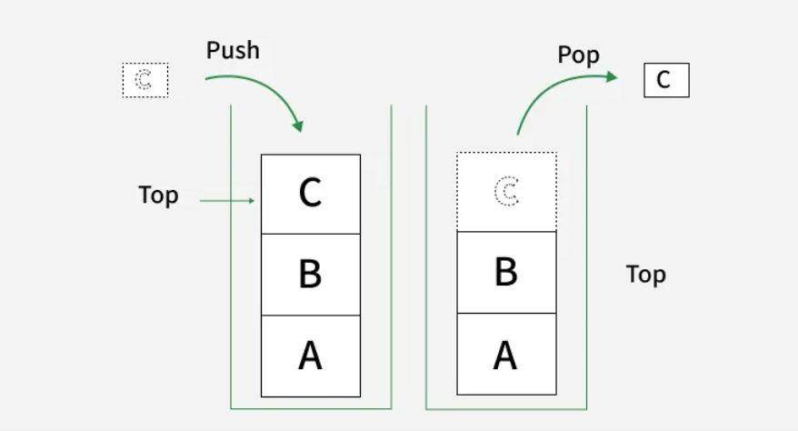

# Stack Data Structure

## What is a Stack?

A Stack is a linear data structure that follows **LIFO** (Last In, First Out) order — the element inserted last is the first one to come out.

Think of it as a stack of plates:
- **Push** — add a new plate on top
- **Pop** — remove the top plate

You can only ever interact with the top. There is no direct access to any element below it.



> **LIFO vs FILO** — two names for the same thing. LIFO (Last In First Out) describes it from the perspective of the last element inserted. FILO (First In Last Out) describes it from the perspective of the first element inserted. Same structure, same behaviour.

---

## Fixed vs Variable Stack

| Type | Backed by | Max size | Overflow possible? |
|------|-----------|----------|--------------------|
| **Fixed Stack** | Array | Set at creation | Yes — stack overflow if full |
| **Variable Stack** | Linked List / Deque | Grows dynamically | No (until memory runs out) |

Use a fixed stack when the maximum size is known in advance and you want cache-friendly memory. Use a variable stack when the size is unpredictable.

---

## Operations

| Operation | Description | Time Complexity |
|-----------|-------------|-----------------|
| `push(x)` | Insert element `x` onto the top | O(1) |
| `pop()` | Remove and return the top element | O(1) |
| `top()` / `peek()` | Return the top element without removing it | O(1) |
| `isEmpty()` | Return true if the stack has no elements | O(1) |
| `size()` | Return the number of elements | O(1) |

All standard stack operations are O(1) — this is what makes it so useful.

 See [Stack in STL](https://github.com/wncc/DSA-Bootcamp-2026/tree/main/Week-1/03-STL) for built-in usage. This file focuses on how a stack is built from scratch.

---

## Implementation

### Using an Array (Fixed Stack)

A stack can be implemented using an array where we maintain:
- An integer array to store elements
- A variable `capacity` to represent the maximum size of the stack
- A variable `top` to track the index of the top element — initially `top = -1` to indicate an empty stack

**C++**
```cpp
class myStack {
    int* arr;       // array to store elements
    int capacity;   // maximum size of stack
    int top;        // index of top element; -1 means stack is empty

public:
    myStack(int cap) {
        capacity = cap;
        arr = new int[capacity];
        top = -1;   // stack is empty initially
    }

    void push(int x) {
        if (top == capacity - 1) {   // no space left
            cout << "Stack Overflow\n";
            return;
        }
        arr[++top] = x;   // increment top first, then insert
    }

    int pop() {
        if (top == -1) {   // nothing to remove
            cout << "Stack Underflow\n";
            return -1;
        }
        return arr[top--];   // return top element, then decrement top
    }

    int peek() {
        if (top == -1) {   // nothing to peek at
            cout << "Stack is Empty\n";
            return -1;
        }
        return arr[top];   // just return without removing
    }

    bool isEmpty() { return top == -1; }           // stack is empty when top is -1
    bool isFull()  { return top == capacity - 1; } // stack is full when top reaches last index
};
```

**Java**
```java
class myStack {
    private int[] arr;       // array to store elements
    private int capacity;    // maximum size of stack
    private int top;         // index of top element; -1 means stack is empty

    public myStack(int cap) {
        capacity = cap;
        arr = new int[capacity];
        top = -1;   // stack is empty initially
    }

    public void push(int x) {
        if (top == capacity - 1) {   // no space left
            System.out.println("Stack Overflow");
            return;
        }
        arr[++top] = x;   // increment top first, then insert
    }

    public int pop() {
        if (top == -1) {   // nothing to remove
            System.out.println("Stack Underflow");
            return -1;
        }
        return arr[top--];   // return top element, then decrement top
    }

    public int peek() {
        if (top == -1) {   // nothing to peek at
            System.out.println("Stack is Empty");
            return -1;
        }
        return arr[top];   // just return without removing
    }

    public boolean isEmpty() { return top == -1; }           // stack is empty when top is -1
    public boolean isFull()  { return top == capacity - 1; } // stack is full when top reaches last index
}
```

**Python**
```python
class myStack:
    def __init__(self, cap):
        self.capacity = cap
        self.arr = [0] * self.capacity
        self.top = -1   # -1 means stack is empty initially

    def push(self, x):
        if self.top == self.capacity - 1:   # no space left
            print("Stack Overflow")
            return
        self.top += 1           # increment top first
        self.arr[self.top] = x  # then insert at new top

    def pop(self):
        if self.top == -1:   # nothing to remove
            print("Stack Underflow")
            return -1
        val = self.arr[self.top]
        self.top -= 1   # decrement top to "remove" the element
        return val

    def peek(self):
        if self.top == -1:   # nothing to peek at
            print("Stack is Empty")
            return -1
        return self.arr[self.top]   # just return without removing

    def isEmpty(self): return self.top == -1           # stack is empty when top is -1
    def isFull(self):  return self.top == self.capacity - 1  # full when top hits last index
```

---

### Using a Linked List (Variable Stack)

A stack can be implemented using a linked list where we maintain:

- A `Node` structure/class that contains:
  - `data` → to store the element
  - `next` → pointer/reference to the node below it in the stack
- A pointer/reference `top` that always points to the current top node of the stack
- Initially, `top = null` to represent an empty stack

**C++**
```cpp
class Node {
public:
    int data;
    Node* next;
    Node(int x) : data(x), next(nullptr) {}  // initialise data and set next to null
};

class myStack {
    Node* top;   // always points to the topmost node
    int count;   // tracks current number of elements

public:
    myStack() : top(nullptr), count(0) {}  // empty stack — top is null

    void push(int x) {
        Node* temp = new Node(x);  // create new node
        temp->next = top;          // new node points to current top
        top = temp;                // new node becomes the new top
        count++;
    }

    int pop() {
        if (top == nullptr) {   // nothing to remove
            cout << "Stack Underflow\n";
            return -1;
        }
        Node* temp = top;       // save current top
        top = top->next;        // move top down to next node
        int val = temp->data;
        delete temp;            // free memory — important in C++
        count--;
        return val;
    }

    int peek() {
        if (top == nullptr) {   // nothing to peek at
            cout << "Stack is Empty\n";
            return -1;
        }
        return top->data;   // just return without removing
    }

    bool isEmpty() { return top == nullptr; }  // empty when top points to nothing
    int size()     { return count; }           // O(1) because we maintain a counter
};
```

**Java**
```java
class Node {
    int data;
    Node next;
    Node(int x) { data = x; next = null; }  // initialise data and set next to null
}

class myStack {
    Node top;   // always points to the topmost node
    int count;  // tracks current number of elements

    myStack() { top = null; count = 0; }  // empty stack — top is null

    void push(int x) {
        Node temp = new Node(x);  // create new node
        temp.next = top;          // new node points to current top
        top = temp;               // new node becomes the new top
        count++;
    }

    int pop() {
        if (top == null) {   // nothing to remove
            System.out.println("Stack Underflow");
            return -1;
        }
        int val = top.data;
        top = top.next;   // move top down to next node; GC handles memory in Java
        count--;
        return val;
    }

    int peek() {
        if (top == null) {   // nothing to peek at
            System.out.println("Stack is Empty");
            return -1;
        }
        return top.data;   // just return without removing
    }

    boolean isEmpty() { return top == null; }  // empty when top points to nothing
    int size()        { return count; }        // O(1) because we maintain a counter
}
```

**Python**
```python
class Node:
    def __init__(self, x):
        self.data = x
        self.next = None   # next points to the node below in the stack

class myStack:
    def __init__(self):
        self.top = None   # empty stack — top points to nothing
        self.count = 0    # tracks current number of elements

    def push(self, x):
        temp = Node(x)         # create new node
        temp.next = self.top   # new node points to current top
        self.top = temp        # new node becomes the new top
        self.count += 1

    def pop(self):
        if self.top is None:   # nothing to remove
            print("Stack Underflow")
            return -1
        val = self.top.data
        self.top = self.top.next   # move top down; Python GC handles deallocation
        self.count -= 1
        return val

    def peek(self):
        if self.top is None:   # nothing to peek at
            print("Stack is Empty")
            return -1
        return self.top.data   # just return without removing

    def isEmpty(self): return self.top is None  # empty when top points to nothing
    def size(self):    return self.count        # O(1) because we maintain a counter
```

---
## Array vs Linked List — Which to Use?

| | Array-based | Linked List-based |
|---|---|---|
| Memory layout | Contiguous (cache friendly) | Scattered (pointer overhead) |
| Max size | Fixed at creation | Dynamic |
| Overhead | Low | One extra pointer per node |
| Overflow risk | Yes | No (until memory exhausted) |
| **Use when** | Size is known in advance | Size is unpredictable |

---

## Resources

- [Stack Data Structure — GeeksforGeeks](https://www.geeksforgeeks.org/dsa/stack-data-structure/)

- [Stack using Arrays — GeeksforGeeks](https://www.geeksforgeeks.org/dsa/implement-stack-using-array/)

- [Stack using Linked List — GeeksforGeeks](https://www.geeksforgeeks.org/dsa/implement-a-stack-using-singly-linked-list/)


