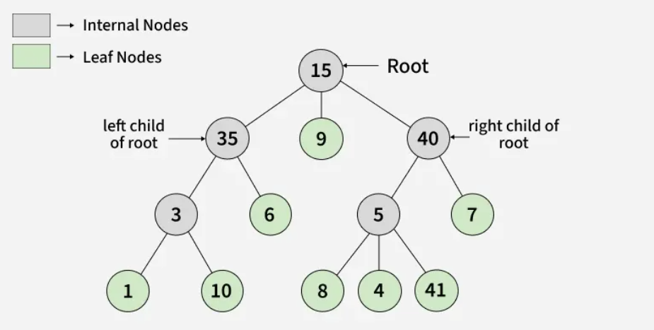

# Tree Data Structure

## Why This Topic Now

Arrays and linked lists are linear — data sits in a sequence. Trees break that constraint. A tree lets you represent hierarchical relationships: file systems, organisation charts, HTML DOM, decision trees. Almost every advanced data structure (heaps, BSTs, tries, segment trees) is a tree underneath. Understanding the general tree first makes all of them easier.

## What is a Tree?

A tree is a **non-linear**, hierarchical data structure of nodes connected by edges, where every node except the root has exactly one parent.



### Key Terms

| Term | Meaning |
|------|---------|
| **Root** | Topmost node — has no parent |
| **Parent** | A node that has child nodes |
| **Child** | A node directly connected below a parent |
| **Leaf** | A node with no children |
| **Edge** | The connection between two nodes |
| **Degree** | Number of children a node has |

---

## Node Representation

Each node stores its value and a list of pointers to its children. Using a list (not a fixed array) means a node can have any number of children.

**C++**
```cpp
class Node {
public:
    int data;
    vector<Node*> children;   // list of pointers to child nodes

    Node(int x) { data = x; } // constructor — children list starts empty
};
```

**Java**
```java
class Node {
    int data;
    List<Node> children = new ArrayList<>();  // list of references to child nodes

    Node(int x) { data = x; }  // constructor — children list starts empty
}
```

**Python**
```python
class Node:
    def __init__(self, data):
        self.data = data
        self.children = []   # list of references to child nodes; starts empty
```

---

## Building a Tree

### Step 1 — Create nodes

Nodes are independent until connected. Creating them just allocates memory.

```cpp
Node* root = new Node(15);   // root of the tree
Node* n2   = new Node(35);
Node* n3   = new Node(1);
Node* n4   = new Node(10);
```

### Step 2 — Connect nodes with addChild

`addChild` links a child into a parent's children list, forming the hierarchy.

**C++**
```cpp
void addChild(Node* parent, Node* child) {
    parent->children.push_back(child);  // append child to parent's list
}
```

**Java**
```java
static void addChild(Node parent, Node child) {
    parent.children.add(child);  // append child to parent's list
}
```

**Python**
```python
def add_child(parent, child):
    parent.children.append(child)  # append child to parent's list
```

**Usage (same logic across all languages):**
```cpp
addChild(root, n2);   // 35 becomes child of 15
addChild(n2, n3);     // 1  becomes child of 35
addChild(n2, n4);     // 10 becomes child of 35
```

This builds the tree level by level. After these three calls, the structure looks like:
```
      15
       |
      35
     /  \
    1   10
```

---

## Tree Operations

All operations below follow the same recursive pattern: **do something at the current node, then recurse into each child**. Once you understand this pattern, all tree traversals feel the same.

---

### Search

**How it works:** Check the current node. If it matches, return true. Otherwise recurse into each child. If no child returns true, return false.

**C++**
```cpp
bool search(Node* node, int key) {
    if (node->data == key) return true;    // found at current node
    for (auto child : node->children)
        if (search(child, key)) return true; // found somewhere in subtree
    return false;                            // not found anywhere
}
```

**Java**
```java
static boolean search(Node node, int key) {
    if (node.data == key) return true;
    for (Node child : node.children)
        if (search(child, key)) return true;
    return false;
}
```

**Python**
```python
def search(node, key):
    if node.data == key: return True
    for child in node.children:
        if search(child, key): return True
    return False
```

---

### Print Parents

**How it works:** Print the current node and its parent. Then recurse into each child, passing the current node as the new parent.

**C++**
```cpp
void printParents(Node* node, Node* parent) {
    if (parent == nullptr)
        cout << node->data << " -> NULL" << endl;   // root has no parent
    else
        cout << node->data << " -> " << parent->data << endl;
    for (auto child : node->children)
        printParents(child, node);   // current node becomes parent for children
}
```

**Java**
```java
static void printParents(Node node, Node parent) {
    if (parent == null)
        System.out.println(node.data + " -> NULL");
    else
        System.out.println(node.data + " -> " + parent.data);
    for (Node child : node.children)
        printParents(child, node);  // current node becomes parent for children
}
```

**Python**
```python
def print_parents(node, parent):
    if parent is None:
        print(f"{node.data} -> NULL")   # root has no parent
    else:
        print(f"{node.data} -> {parent.data}")
    for child in node.children:
        print_parents(child, node)  # current node becomes parent for children
```

---

### Print Children

**How it works:** Print the current node followed by all its children on one line. Then recurse into each child to do the same.

**C++**
```cpp
void printChildren(Node* node) {
    cout << node->data << " -> ";
    for (auto child : node->children) cout << child->data << " ";  // print all children
    cout << endl;
    for (auto child : node->children) printChildren(child);        // recurse into each child
}
```

**Java**
```java
static void printChildren(Node node) {
    System.out.print(node.data + " -> ");
    for (Node child : node.children) System.out.print(child.data + " ");
    System.out.println();
    for (Node child : node.children) printChildren(child);
}
```

**Python**
```python
def print_children(node):
    print(f"{node.data} -> ", end="")
    for child in node.children: print(child.data, end=" ")  # print all children
    print()
    for child in node.children: print_children(child)       # recurse into each child
```

---

### Print Leaf Nodes

**How it works:** If a node has no children, it is a leaf — print it. Otherwise recurse into each child. Leaves are found scattered throughout the tree at all depths.

**C++**
```cpp
void printLeafNodes(Node* node) {
    if (node->children.empty()) {  // no children = leaf node
        cout << node->data << " ";
        return;
    }
    for (auto child : node->children) printLeafNodes(child);  // keep going deeper
}
```

**Java**
```java
static void printLeafNodes(Node node) {
    if (node.children.isEmpty()) {  // no children = leaf node
        System.out.print(node.data + " ");
        return;
    }
    for (Node child : node.children) printLeafNodes(child);
}
```

**Python**
```python
def print_leaf_nodes(node):
    if not node.children:           # no children = leaf node
        print(node.data, end=" ")
        return
    for child in node.children: print_leaf_nodes(child)  # keep going deeper
```

---

### Print Degree of Each Node

**How it works:** Degree = number of children + 1 (for the edge to its parent), except for the root which has no parent. Count children, add 1 if a parent exists, print, then recurse.

**C++**
```cpp
void printDegree(Node* node, Node* parent) {
    int degree = node->children.size();  // count children
    if (parent != nullptr) degree++;     // add 1 for edge to parent (skip for root)
    cout << node->data << " -> " << degree << endl;
    for (auto child : node->children) printDegree(child, node);
}
```

**Java**
```java
static void printDegree(Node node, Node parent) {
    int degree = node.children.size();
    if (parent != null) degree++;        // add 1 for edge to parent (skip for root)
    System.out.println(node.data + " -> " + degree);
    for (Node child : node.children) printDegree(child, node);
}
```

**Python**
```python
def print_degree(node, parent):
    degree = len(node.children)          # count children
    if parent is not None: degree += 1   # add 1 for edge to parent (skip for root)
    print(f"{node.data} -> {degree}")
    for child in node.children: print_degree(child, node)
```

---

## Before You Move On

- Can you draw the tree formed by the example above on paper?
- Do you understand why all these operations use recursion — not loops?
- Can you write `search()` without looking at your notes?
- What is the degree of the root node in the example tree?

## Resources

- [Tree Data Structure — GeeksforGeeks](https://www.geeksforgeeks.org/dsa/introduction-to-tree-data-structure/)


