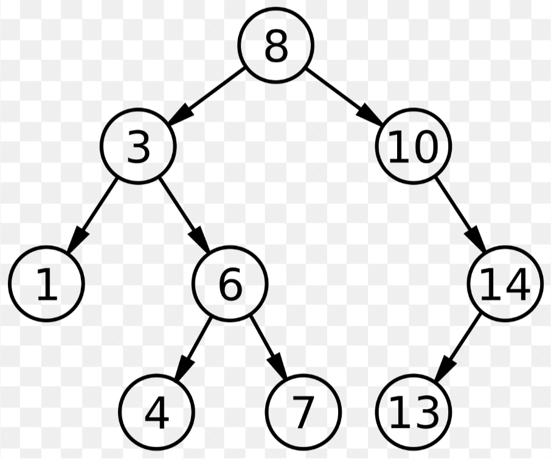

# Binary Search Tree

## Why This Topic Now

You know binary trees — any structure, any values. A BST adds one rule: **left < node < right**, always. That single constraint transforms the tree into a searchable, sortable structure. Instead of scanning every node like a general tree, you can find, insert, or delete any value in O(log n) on average — the same reason binary search on arrays is fast, now applied to a dynamic structure.

## What is a BST?

A Binary Search Tree is a binary tree where each node contains a unique key and satisfies:
- All nodes in the **left subtree** have values **strictly less than** the node's value.
- All nodes in the **right subtree** have values **strictly greater than** the node's value.



---

## Node Representation

**C++**
```cpp
class Node {
public:
    int data;
    Node* left;    // pointer to left child (smaller values)
    Node* right;   // pointer to right child (larger values)
    Node(int data) {
        this->data  = data;
        this->left  = NULL;   // no left child initially
        this->right = NULL;   // no right child initially
    }
};
```

**Java**
```java
class Node {
    int data;
    Node left, right;   // references to left and right children
    Node(int data) {
        this.data  = data;
        this.left  = null;   // no left child initially
        this.right = null;   // no right child initially
    }
}
```

**Python**
```python
class Node:
    def __init__(self, data):
        self.data  = data
        self.left  = None   # no left child initially
        self.right = None   # no right child initially
```

---

## Creating a BST

A BST is built by inserting elements one by one using the insertion rule:
- If the tree is empty, create a new node and make it the root.
- Compare the value with the current node.
- If smaller, move left; if larger, move right.
- Repeat until an empty spot is found, then insert there.

**C++**
```cpp
Node* insertIntoBST(Node* root, int data) {
    if (root == NULL) return new Node(data);       // base case — insert here
    if (data < root->data)
        root->left  = insertIntoBST(root->left,  data);  // go left — data is smaller
    else if (data > root->data)
        root->right = insertIntoBST(root->right, data);  // go right — data is larger
    return root;
}

Node* takeInput(Node* root) {
    int data; cin >> data;
    while (data != -1) {                           // -1 signals end of input
        root = insertIntoBST(root, data);
        cin >> data;
    }
    return root;
}
```

**Java**
```java
static Node insertIntoBST(Node root, int data) {
    if (root == null) return new Node(data);          // base case — insert here
    if (data < root.data)
        root.left  = insertIntoBST(root.left,  data); // go left — data is smaller
    else if (data > root.data)
        root.right = insertIntoBST(root.right, data); // go right — data is larger
    return root;
}

static Node takeInput(Node root) {
    Scanner sc = new Scanner(System.in);
    int data = sc.nextInt();
    while (data != -1) {                              // -1 signals end of input
        root = insertIntoBST(root, data);
        data = sc.nextInt();
    }
    return root;
}
```

**Python**
```python
def insert_into_bst(root, data):
    if root is None: return Node(data)                    # base case — insert here
    if data < root.data:
        root.left  = insert_into_bst(root.left,  data)   # go left — data is smaller
    elif data > root.data:
        root.right = insert_into_bst(root.right, data)   # go right — data is larger
    return root

def take_input(root):
    while True:
        data = int(input())
        if data == -1: break                              # -1 signals end of input
        root = insert_into_bst(root, data)
    return root
```

---

## Insertion of a Node

A new key is inserted at the position that maintains the BST property. We start from the root and move downward:
- If the key is smaller, go left.
- If larger, go right.
- We continue until we find an unoccupied spot where the node can be placed without violating the BST property, and insert it there as a new leaf.

**C++**
```cpp
Node* insertion(Node* root, int element) {
    if (root == NULL) return new Node(element);              // base case — insert here
    if (element < root->data)
        root->left  = insertion(root->left,  element);       // go left — element is smaller
    else if (element > root->data)
        root->right = insertion(root->right, element);       // go right — element is larger
    return root;
}
```

**Java**
```java
static Node insertion(Node root, int element) {
    if (root == null) return new Node(element);              // base case — insert here
    if (element < root.data)
        root.left  = insertion(root.left,  element);         // go left — element is smaller
    else if (element > root.data)
        root.right = insertion(root.right, element);         // go right — element is larger
    return root;
}
```

**Python**
```python
def insertion(root, element):
    if root is None: return Node(element)                    # base case — insert here
    if element < root.data:
        root.left  = insertion(root.left,  element)          # go left — element is smaller
    elif element > root.data:
        root.right = insertion(root.right, element)          # go right — element is larger
    return root
```

---

## Search a Node in BST

- Compare the element with the value of the root.
- If equal, search is done — return True.
- If smaller, search the left subtree.
- If greater, search the right subtree.
- Repeat until found or a null node is reached.
- If at any point the element is found, return True. If the node is null, return False.

**C++**
```cpp
bool searchInBST(Node* root, int element) {
    if (root == NULL)             return false;                       // not found
    if (root->data == element)    return true;                        // found
    if (root->data >  element)    return searchInBST(root->left,  element);  // go left
    if (root->data <  element)    return searchInBST(root->right, element);  // go right
    return false;
}
```

**Java**
```java
static boolean searchInBST(Node root, int element) {
    if (root == null)           return false;                          // not found
    if (root.data == element)   return true;                           // found
    if (root.data >  element)   return searchInBST(root.left,  element); // go left
    if (root.data <  element)   return searchInBST(root.right, element); // go right
    return false;
}
```

**Python**
```python
def search_in_bst(root, element):
    if root is None:            return False                               # not found
    if root.data == element:    return True                                # found
    if root.data >  element:    return search_in_bst(root.left,  element) # go left
    if root.data <  element:    return search_in_bst(root.right, element) # go right
    return False
```

---

## Traversing the BST

Inorder, Preorder, Postorder, and Level Order work exactly the same way in a BST as in a general Binary Tree and have already been covered in detail there.

The one thing worth noting is that **Inorder traversal (Left → Root → Right) of a BST always gives a sorted sequence** — this is a direct consequence of the BST property and is one of its most useful characteristics.

---

## Finding Minimum / Maximum Value

Since the left subtree always holds smaller values and the right always holds larger ones:
- **Minimum** → keep going left until you can't anymore — that's the smallest node.
- **Maximum** → keep going right until you can't anymore — that's the largest node.

**C++**
```cpp
Node* minVal(Node* root) {
    Node* temp = root;
    while (temp->left != NULL) temp = temp->left;   // keep going left
    return temp;
}
Node* maxVal(Node* root) {
    Node* temp = root;
    while (temp->right != NULL) temp = temp->right; // keep going right
    return temp;
}
```

**Java**
```java
static Node minVal(Node root) {
    Node temp = root;
    while (temp.left != null) temp = temp.left;    // keep going left
    return temp;
}
static Node maxVal(Node root) {
    Node temp = root;
    while (temp.right != null) temp = temp.right;  // keep going right
    return temp;
}
```

**Python**
```python
def min_val(root):
    temp = root
    while temp.left is not None: temp = temp.left   # keep going left
    return temp

def max_val(root):
    temp = root
    while temp.right is not None: temp = temp.right # keep going right
    return temp
```

---

## Deletion of a Node

Find the node to be deleted by traversing the BST (left if smaller, right if larger), then handle one of three cases:
- **Leaf node (no children):** Simply delete the node and set its parent's pointer to NULL.
- **One child:** Replace the node with its only child, then delete the node.
- **Two children:** Find the inorder successor (smallest node in right subtree), copy its value into the node to be deleted, then delete the inorder successor from its original position (which will be a Case 1 or Case 2 deletion).

**C++**
```cpp
Node* getSuccessor(Node* curr) {
    curr = curr->right;
    while (curr != nullptr && curr->left != nullptr)
        curr = curr->left;   // go to leftmost node in right subtree
    return curr;
}

Node* delNode(Node* root, int x) {
    if (root == nullptr) return root;
    if      (root->data > x) root->left  = delNode(root->left,  x); // go left
    else if (root->data < x) root->right = delNode(root->right, x); // go right
    else {
        if (root->left  == nullptr) { Node* t = root->right; delete root; return t; } // case 1 or 2
        if (root->right == nullptr) { Node* t = root->left;  delete root; return t; } // case 2
        Node* succ  = getSuccessor(root);    // case 3 — find inorder successor
        root->data  = succ->data;            // copy successor's value here
        root->right = delNode(root->right, succ->data); // delete successor from right subtree
    }
    return root;
}
```

**Java**
```java
static Node getSuccessor(Node curr) {
    curr = curr.right;
    while (curr != null && curr.left != null)
        curr = curr.left;   // go to leftmost node in right subtree
    return curr;
}

static Node delNode(Node root, int x) {
    if (root == null) return root;
    if      (root.data > x) root.left  = delNode(root.left,  x); // go left
    else if (root.data < x) root.right = delNode(root.right, x); // go right
    else {
        if (root.left  == null) return root.right;  // case 1 or 2
        if (root.right == null) return root.left;   // case 2
        Node succ  = getSuccessor(root);   // case 3 — find inorder successor
        root.data  = succ.data;            // copy successor's value here
        root.right = delNode(root.right, succ.data); // delete successor from right subtree
    }
    return root;
}
```

**Python**
```python
def get_successor(curr):
    curr = curr.right
    while curr is not None and curr.left is not None:
        curr = curr.left   # go to leftmost node in right subtree
    return curr

def del_node(root, x):
    if root is None: return root
    if   root.data > x: root.left  = del_node(root.left,  x)  # go left
    elif root.data < x: root.right = del_node(root.right, x)  # go right
    else:
        if root.left  is None: return root.right  # case 1 or 2
        if root.right is None: return root.left   # case 2
        succ       = get_successor(root)           # case 3 — find inorder successor
        root.data  = succ.data                     # copy successor's value here
        root.right = del_node(root.right, succ.data) # delete successor from right subtree
    return root
```

---

## Time and Space Complexity

| Operation | Average Case (Balanced) | Worst Case (Skewed) | Space (Recursive Stack) |
|-----------|------------------------|---------------------|-------------------------|
| Insertion | O(log n) | O(n) | O(log n) / O(n) |
| Deletion | O(log n) | O(n) | O(log n) / O(n) |
| Search | O(log n) | O(n) | O(log n) / O(n) |
| Find Min/Max | O(log n) | O(n) | O(1) (iterative) |

> **Note:** Worst case O(n) occurs when the BST is completely skewed (e.g. inserting already-sorted data), degenerating into a linked list. Space complexity drops to O(1) when operations are implemented iteratively.

---

## Before You Move On

- Can you insert a sequence of numbers and draw the resulting BST on paper?
- Do you understand why inorder traversal of a BST gives sorted output?
- Can you trace the deletion of a node with two children step by step?

# Problem Set
## Easy

- [Convert Sorted Array to Binary Search Tree](https://leetcode.com/problems/convert-sorted-array-to-binary-search-tree/description/?envType=problem-list-v2&envId=binary-search-tree)
- [Find Mode in Binary Search Tree](https://leetcode.com/problems/find-mode-in-binary-search-tree/description/?envType=problem-list-v2&envId=binary-search-tree)
[Range Sum of BST](https://leetcode.com/problems/range-sum-of-bst/description/)

## Medium

- [Validate Binary Search Tree](https://leetcode.com/problems/validate-binary-search-tree/description/)
- [Lowest Common Ancestor of a Binary Search Tree](http://leetcode.com/problems/lowest-common-ancestor-of-a-binary-search-tree/description/)

## Hard

- [Recover Binary Search Tree](https://leetcode.com/problems/recover-binary-search-tree/description/)
- [Merge BSTs to Create Single BST](https://leetcode.com/problems/merge-bsts-to-create-single-bst/description/)

## Resources

- [Introduction to BST — GeeksforGeeks](https://www.geeksforgeeks.org/dsa/introduction-to-binary-search-tree/)
- [Insertion in BST — GeeksforGeeks](https://www.geeksforgeeks.org/dsa/insertion-in-binary-search-tree/)
- [Searching in BST — GeeksforGeeks](https://www.geeksforgeeks.org/dsa/binary-search-tree-set-1-search-and-insertion/)
- [Deletion in BST — GeeksforGeeks](https://www.geeksforgeeks.org/dsa/deletion-in-binary-search-tree/)

