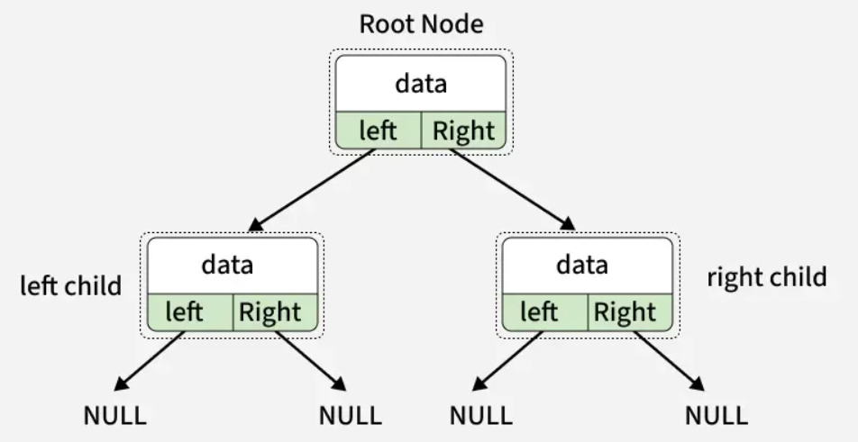

# Binary Trees

## Why This Topic Now

You just learned general trees where a node can have any number of children. Binary trees restrict each node to **at most two children** — left and right. This constraint is what makes binary trees so powerful: it enables ordered search (BST), efficient priority management (heaps), and expression parsing. Almost every advanced tree structure you'll encounter is binary.

## What is a Binary Tree?

A Binary Tree is a non-linear, hierarchical data structure where each node has **at most two children** — referred to as the **left child** and the **right child**. The topmost node is the root; nodes with no children are leaves.



---

## Node Representation

Each node stores its value and pointers to its left and right children. Both start as `null` — children are linked later.

**C++**
```cpp
class Node {
public:
    int data;
    Node* left;    // pointer to left child
    Node* right;   // pointer to right child

    Node(int data) {
        this->data  = data;
        this->left  = NULL;   // no left child initially
        this->right = NULL;   // no right child initially
    }
};
```

**Java**
```java
class Node {
    int data;
    Node left, right;   // references to left and right children

    Node(int data) {
        this.data  = data;
        this.left  = null;   // no left child initially
        this.right = null;   // no right child initially
    }
}
```

**Python**
```python
class Node:
    def __init__(self, data):
        self.data  = data
        self.left  = None   # no left child initially
        self.right = None   # no right child initially
```

---

## Creating a Binary Tree

- Create a node containing the given value.
- If the tree is empty, make this node the root.
- For each node, connect its left and right children as required.
- Continue linking nodes until the desired tree structure is formed.

**How it works:**
- Read a value from the user. If it is `-1`, there is no node here — return `null` (base case).
- Otherwise create a node, then recursively ask for its left subtree, then its right subtree.
- The user enters values in pre-order (root first, then left subtree, then right subtree). Enter `-1` to indicate a missing child.

**C++**
```cpp
Node* buildTree(Node* root) {
    cout << "Enter data (-1 for no node): ";
    int data; cin >> data;

    if (data == -1) return NULL;            // base case — no node here
    root = new Node(data);                  // create node with entered value
    
    cout << "Enter left child of "  << data << ": ";
    root->left  = buildTree(root->left);    // recursively build left subtree

    cout << "Enter right child of " << data << ": ";
    root->right = buildTree(root->right);   // recursively build right subtree
    return root;
}
```

**Java**
```java
static Scanner sc = new Scanner(System.in);
static Node buildTree(Node root) {
    System.out.print("Enter data (-1 for no node): ");
    int data = sc.nextInt();

    if (data == -1) return null;              // base case — no node here
    root = new Node(data);                    // create node with entered value

    System.out.print("Enter left child of "  + data + ": ");
    root.left  = buildTree(root.left);        // recursively build left subtree

    System.out.print("Enter right child of " + data + ": ");
    root.right = buildTree(root.right);       // recursively build right subtree
    return root;
}
```

**Python**
```python
def buildTree(root):
    data = int(input("Enter data (-1 for no node): "))
    if data == -1: return None                       # base case — no node here
    root = Node(data)                                # create node with entered value

    print(f"Enter left child of {data}: ", end="")
    root.left  = buildTree(root.left)                # recursively build left subtree

    print(f"Enter right child of {data}: ", end="")
    root.right = buildTree(root.right)               # recursively build right subtree
    return root
```

---

## Level Order Traversal

Level Order Traversal visits nodes level by level from top to bottom and from left to right within each level. It uses a queue and is an application of Breadth-First Search (BFS).

### Steps
- If the root is null, return.
- Insert the root node into a queue, then push `null` as a level separator.
- While the queue is not empty:
  - Remove the front node.
  - If it is `null` — end of level: print newline, push another `null` if nodes remain.
  - Otherwise print the node and enqueue its left and right children.
- Continue until all nodes have been processed.

- Time Complexity: O(N)
- Space Complexity: O(N)

**C++**
```cpp
void levelOrderTraversal(Node* root) {
    queue<Node*> q;
    q.push(root);
    q.push(NULL);                          // NULL acts as a level separator

    while (!q.empty()) {
        Node* temp = q.front(); q.pop();

        if (temp == NULL) {                // end of current level
            cout << endl;
            if (!q.empty()) q.push(NULL); // add separator for next level

        } else {
            cout << temp->data << " ";
            if (temp->left)  q.push(temp->left);    // enqueue left child
            if (temp->right) q.push(temp->right);   // enqueue right child
        }
    }
}
```

**Java**
```java
static void levelOrderTraversal(Node root) {
    Queue<Node> q = new LinkedList<>();
    q.add(root);
    q.add(null);                             // null acts as a level separator

    while (!q.isEmpty()) {
        Node temp = q.poll();

        if (temp == null) {                  // end of current level
            System.out.println();
            if (!q.isEmpty()) q.add(null);   // add separator for next level

        } else {
            System.out.print(temp.data + " ");
            if (temp.left  != null) q.add(temp.left);    // enqueue left child
            if (temp.right != null) q.add(temp.right);   // enqueue right child
        }
    }
}
```

**Python**
```python
from collections import deque
def levelOrderTraversal(root):
    q = deque([root, None])        # None acts as a level separator

    while q:
        temp = q.popleft()

        if temp is None:           # end of current level
            print()
            if q: q.append(None)  # add separator for next level

        else:
            print(temp.data, end=" ")
            if temp.left:  q.append(temp.left)    # enqueue left child
            if temp.right: q.append(temp.right)   # enqueue right child
```

---

## Inorder Traversal (Left → Root → Right)

Inorder Traversal first visits the left subtree, then the current node, and finally the right subtree.

### Steps
- Traverse the left subtree recursively.
- Visit/process the current node.
- Traverse the right subtree recursively.
- Repeat until all nodes are visited.

- Order: Left → Root → Right (LNR)
- Time Complexity: O(N) · Space Complexity: O(H), where H is the height of the tree.

**C++**
```cpp
void inOrder(Node* root) {
    if (root == NULL) return;    // base case — empty subtree
    inOrder(root->left);         // L — recurse into left subtree

    cout << root->data << " ";   // N — visit current node
    inOrder(root->right);        // R — recurse into right subtree
}
```

**Java**
```java
static void inOrder(Node root) {
    if (root == null) return;                 // base case — empty subtree
    inOrder(root.left);                       // L — recurse into left subtree

    System.out.print(root.data + " ");        // N — visit current node
    inOrder(root.right);                      // R — recurse into right subtree
}
```

**Python**
```python
def inOrder(root):
    if root is None: return           # base case — empty subtree
    inOrder(root.left)                # L — recurse into left subtree

    print(root.data, end=" ")         # N — visit current node
    inOrder(root.right)               # R — recurse into right subtree
```

---

## Preorder Traversal (Root → Left → Right)

Preorder Traversal visits the current node before exploring its subtrees. It is commonly used for tree serialization, copying a tree, and expression trees.

### Steps
- Visit/process the current node.
- Traverse the left subtree recursively.
- Traverse the right subtree recursively.
- Repeat for all nodes.

- Order: Root → Left → Right (NLR)
- Time Complexity: O(N) · Space Complexity: O(H)

**C++**
```cpp
void preOrder(Node* root) {
    if (root == NULL) return;    // base case — empty subtree

    cout << root->data << " ";   // N — visit current node first
    preOrder(root->left);        // L — recurse into left subtree
    preOrder(root->right);       // R — recurse into right subtree
}
```

**Java**
```java
static void preOrder(Node root) {
    if (root == null) return;                 // base case — empty subtree

    System.out.print(root.data + " ");        // N — visit current node first
    preOrder(root.left);                      // L — recurse into left subtree
    preOrder(root.right);                     // R — recurse into right subtree
}
```

**Python**
```python
def preOrder(root):
    if root is None: return           # base case — empty subtree

    print(root.data, end=" ")         # N — visit current node first
    preOrder(root.left)               # L — recurse into left subtree
    preOrder(root.right)              # R — recurse into right subtree
```

---

## Postorder Traversal (Left → Right → Root)

Postorder Traversal visits both subtrees before visiting the current node. It is useful when deleting a tree or evaluating expression trees.

### Steps
- Traverse the left subtree recursively.
- Traverse the right subtree recursively.
- Visit/process the current node.
- Repeat until all nodes are visited.

- Order: Left → Right → Root (LRN)
- Time Complexity: O(N) · Space Complexity: O(H)

**C++**
```cpp
void postOrder(Node* root) {
    if (root == NULL) return;    // base case — empty subtree

    postOrder(root->left);       // L — recurse into left subtree
    postOrder(root->right);      // R — recurse into right subtree
    cout << root->data << " ";   // N — visit current node last
}
```

**Java**
```java
static void postOrder(Node root) {
    if (root == null) return;                 // base case — empty subtree

    postOrder(root.left);                     // L — recurse into left subtree
    postOrder(root.right);                    // R — recurse into right subtree
    System.out.print(root.data + " ");        // N — visit current node last
}
```

**Python**
```python
def postOrder(root):
    if root is None: return           # base case — empty subtree

    postOrder(root.left)              # L — recurse into left subtree
    postOrder(root.right)             # R — recurse into right subtree
    print(root.data, end=" ")         # N — visit current node last
```

---

## Traversal Summary

| Traversal | Order | Common Use |
|-----------|-------|------------|
| **Inorder** | Left → Root → Right | Sorted output in BST |
| **Preorder** | Root → Left → Right | Copy / serialize a tree |
| **Postorder** | Left → Right → Root | Delete a tree, evaluate expressions |
| **Level Order** | Level by level (BFS) | Shortest path, level-wise processing |

---

## Build From Level Order Input

In this approach, the binary tree is constructed level by level, similar to Level Order Traversal (BFS). A queue is used to keep track of nodes whose children are yet to be assigned. The user enters the left and right child of each node, and `-1` is used to indicate the absence of a child.

### Steps
1. Input the value of the root node and create the root.
2. Insert the root into a queue.
3. While the queue is not empty:
   - Remove the front node from the queue.
   - Input its left child. If not `-1`, create the node, attach it, and enqueue it.
   - Input its right child. If not `-1`, create the node, attach it, and enqueue it.
4. Repeat until all levels of the tree have been constructed.

**C++**
```cpp
void buildFromLevelOrder(Node* &root) {
    queue<Node*> q;
    cout << "Enter data for root: ";
    int data; cin >> data;
    root = new Node(data); q.push(root);   // create root and enqueue it

    while (!q.empty()) {
        Node* temp = q.front(); q.pop();   // dequeue next node to assign children
        int leftData, rightData;

        cout << "Enter left child of "  << temp->data << " (-1 for none): "; cin >> leftData;
        if (leftData != -1)  { temp->left  = new Node(leftData);  q.push(temp->left);  }

        cout << "Enter right child of " << temp->data << " (-1 for none): "; cin >> rightData;
        if (rightData != -1) { temp->right = new Node(rightData); q.push(temp->right); }
    }
}
```

**Java**
```java
public static void buildFromLevelOrder(Node[] root) {
    Queue<Node> q = new LinkedList<>();
    System.out.print("Enter data for root: ");
    root[0] = new Node(sc.nextInt()); q.add(root[0]);  // create root and enqueue it
    while (!q.isEmpty()) {
        Node temp = q.poll();                           // dequeue next node to assign children
        System.out.print("Enter left child of "  + temp.data + " (-1 for none): ");

        int leftData = sc.nextInt();
    
        if (leftData  != -1) { temp.left  = new Node(leftData);  q.add(temp.left);  }
        System.out.print("Enter right child of " + temp.data + " (-1 for none): ");
        
        int rightData = sc.nextInt();
        if (rightData != -1) { temp.right = new Node(rightData); q.add(temp.right); }
    }
}
```

**Python**
```python
def build_from_level_order(root):
    from collections import deque
    q = deque()
    data = int(input("Enter data for root: "))
    root[0] = Node(data); q.append(root[0])   # create root and enqueue it
    while q:
        temp = q.popleft()                     # dequeue next node to assign children

        left_data = int(input(f"Enter left child of {temp.data} (-1 for none): "))
        if left_data  != -1: temp.left  = Node(left_data);  q.append(temp.left)
        
        right_data = int(input(f"Enter right child of {temp.data} (-1 for none): "))
        if right_data != -1: temp.right = Node(right_data); q.append(temp.right)
```

---

## Before You Move On

- Can you trace inorder, preorder, and postorder on the same tree and get three different outputs?
- Do you understand why level order uses a queue but the other traversals use recursion?
- Can you build a tree from level order input on paper before running the code?
- What traversal would you use to delete an entire binary tree — and why?

## Resources

- [Binary Tree — GeeksforGeeks](https://www.geeksforgeeks.org/dsa/binary-tree-data-structure/)
- [Tree Traversals — GeeksforGeeks](https://www.geeksforgeeks.org/dsa/tree-traversals-inorder-preorder-and-postorder/)
- [Level Order Traversal — GeeksforGeeks](https://www.geeksforgeeks.org/dsa/level-order-tree-traversal/)

