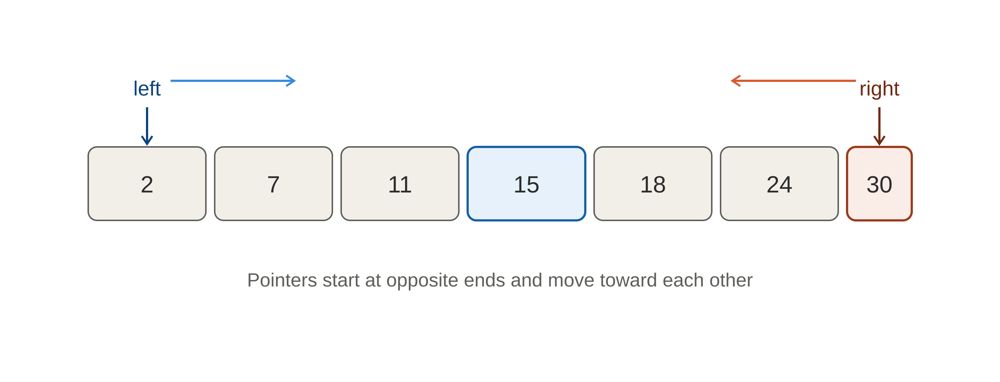
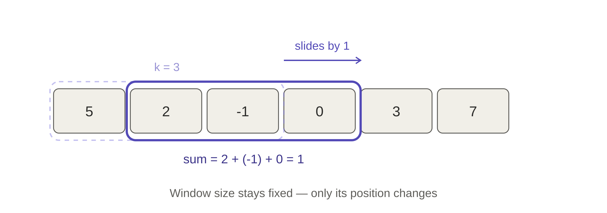
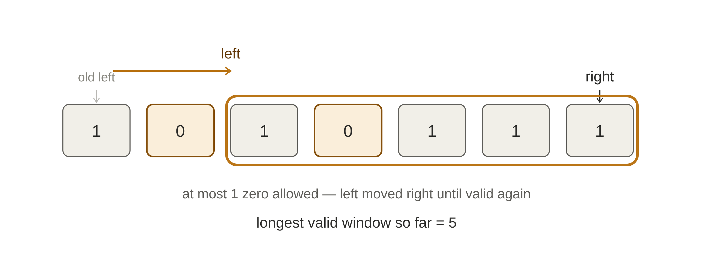
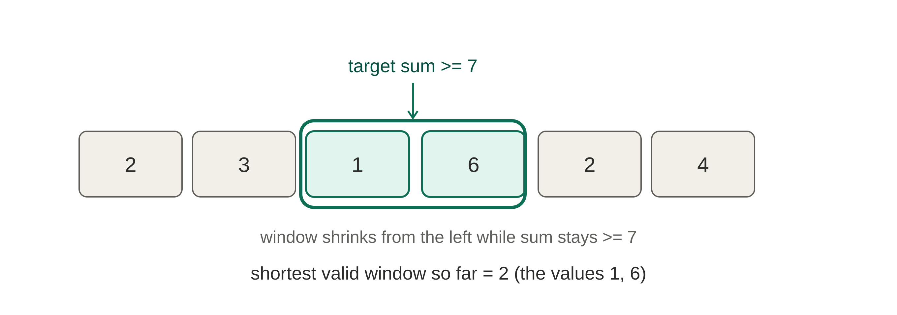
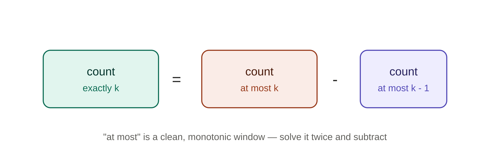

# Sliding Window & Two Pointers

Patterns that turn brute-force `O(n²)` array/string problems into `O(n)` solutions by avoiding repeated work. If you ever find yourself writing two nested loops over an array or string just to re-scan the same elements again and again, this topic is what fixes that.

---

## 1. What Is Two Pointers?

Two Pointers means using **two index variables** to traverse a data structure instead of one, so you can compare or combine elements from two positions without nested loops.

Two common flavors:

- **Opposite ends, moving inward** — one pointer starts at the beginning, one at the end, and they move toward each other. Used in sorted-array problems like pair-sum or palindrome checks.
- **Same direction, different speeds** — both pointers move left to right, but the second one only advances when some condition is met. This is the same engine that powers sliding window.

```
Opposite ends:   l →                    ← r
                 [ 2,  7,  11,  15 ]

Same direction:        l         r
                 [ 1,  2,  2,  3,  1 ]  →  both move rightward
```

---

## 2. What Is a Sliding Window?

A sliding window is a **contiguous block** of elements (a subarray or substring) marked by two pointers, `left` and `right`. Instead of recomputing the answer for every possible subarray from scratch, you slide this window across the array — adding one element on the right, and removing one element from the left when needed — and reuse the work already done.

There are two kinds of windows:

| Type | Window size | When to use |
|---|---|---|
| **Fixed-size window** | Stays constant (`k` is given) | "subarray of size `k`", "every window of length `k`" |
| **Variable-size window** | Grows and shrinks | "longest/shortest subarray such that...", "at most/exactly `k` distinct..." |

### Recognizing a Sliding Window Problem

Ask yourself:
- Does the problem involve a **contiguous** subarray or substring?
- Is it asking for the **longest / shortest / count** of such subarrays?
- Does shrinking the window only ever make the condition "more true" or "less true" (monotonic), never both? If yes — sliding window applies.

---

## 3. The Core Templates

### Fixed-Size Window

Expand by one on the right, and the moment the window exceeds size `k`, shrink by one from the left. The window size never changes after that.

**Python**
```python
def fixed_window(arr, k):
    window_sum = 0
    best = float('-inf')
    left = 0

    for right in range(len(arr)):
        window_sum += arr[right]

        if right - left + 1 == k:
            best = max(best, window_sum)
            window_sum -= arr[left]
            left += 1

    return best
```

**Java**
```java
public int fixedWindow(int[] arr, int k) {
    int windowSum = 0, best = Integer.MIN_VALUE, left = 0;

    for (int right = 0; right < arr.length; right++) {
        windowSum += arr[right];

        if (right - left + 1 == k) {
            best = Math.max(best, windowSum);
            windowSum -= arr[left];
            left++;
        }
    }
    return best;
}
```

**C++**
```cpp
int fixedWindow(vector<int>& arr, int k) {
    int windowSum = 0, best = INT_MIN, left = 0;

    for (int right = 0; right < arr.size(); right++) {
        windowSum += arr[right];

        if (right - left + 1 == k) {
            best = max(best, windowSum);
            windowSum -= arr[left];
            left++;
        }
    }
    return best;
}
```

### Variable-Size Window

Expand the right pointer freely. Whenever the window breaks the required condition, shrink from the left **until it's valid again**. Update the answer at the right moment depending on whether you want the longest or shortest valid window.

**Python**
```python
def variable_window(arr, condition_limit):
    left = 0
    best = 0
    state = 0  # whatever you're tracking: sum, count, distinct elements...

    for right in range(len(arr)):
        state += arr[right]  # expand

        while state > condition_limit:  # shrink while invalid
            state -= arr[left]
            left += 1

        best = max(best, right - left + 1)  # update answer

    return best
```

**Java**
```java
public int variableWindow(int[] arr, int conditionLimit) {
    int left = 0, best = 0, state = 0;

    for (int right = 0; right < arr.length; right++) {
        state += arr[right];

        while (state > conditionLimit) {
            state -= arr[left];
            left++;
        }
        best = Math.max(best, right - left + 1);
    }
    return best;
}
```

**C++**
```cpp
int variableWindow(vector<int>& arr, int conditionLimit) {
    int left = 0, best = 0, state = 0;

    for (int right = 0; right < arr.size(); right++) {
        state += arr[right];

        while (state > conditionLimit) {
            state -= arr[left];
            left++;
        }
        best = max(best, right - left + 1);
    }
    return best;
}
```

> The **three-pointer ("brute → better → optimal") shrink trick** also shows up a lot: instead of a `while` loop shrinking the window character-by-character, sometimes you shrink by exactly one step per outer iteration. Both give `O(n)` — pick whichever reads cleaner for the problem.

---

## 4. Why It's `O(n)` and Not `O(n²)`

In the brute-force approach, for every `left` you re-scan every possible `right`, recomputing the window's sum/count/state from scratch — that's `O(n²)`.

In sliding window, `right` only ever moves forward, and `left` only ever moves forward too — **neither pointer ever goes backward**. So across the whole run, `right` takes at most `n` steps and `left` takes at most `n` steps. Total work: `O(n)`.

---

## 5. The 3-Step Mental Model (Brute → Better → Optimal)

Use this process whenever you're stuck on a new problem:

1. **Brute force**: try every subarray/substring with two nested loops. Get it correct first.
2. **Better**: notice that shrinking the window happens with a `while` loop instead of restarting — this removes redundant work but might still touch elements more than necessary.
3. **Optimal**: realize the left pointer never needs to reset to the start; it only moves forward, monotonically, across the entire array — giving the true `O(n)` solution.

---

## 6. The Different Types of Sliding Window / Two Pointers

Almost every problem you'll see falls into one of these types. Each one is the same core idea — two pointers, a moving window — with one extra rule layered on top. Below, each type is explained with **one worked example**, in Python, Java, and C++.

### Type 1 — Two Pointers from Opposite Ends



Used when the array is sorted (or order doesn't matter) and you need to compare or combine an element from the front with one from the back. `left` starts at index `0`, `right` starts at the last index, and they move **toward** each other.

**Example: Two Sum on a sorted array** — given a sorted array, find a pair of numbers that add up to a target.

If `arr[left] + arr[right]` is too small, the only way to increase it is to move `left` rightward (since the array is sorted, that gives a bigger number). If it's too large, move `right` leftward.

**Python**
```python
def two_sum_sorted(arr, target):
    left, right = 0, len(arr) - 1

    while left < right:
        current = arr[left] + arr[right]
        if current == target:
            return [left, right]
        elif current < target:
            left += 1
        else:
            right -= 1

    return [-1, -1]
```

**Java**
```java
public int[] twoSumSorted(int[] arr, int target) {
    int left = 0, right = arr.length - 1;

    while (left < right) {
        int current = arr[left] + arr[right];
        if (current == target) {
            return new int[]{left, right};
        } else if (current < target) {
            left++;
        } else {
            right--;
        }
    }
    return new int[]{-1, -1};
}
```

**C++**
```cpp
vector<int> twoSumSorted(vector<int>& arr, int target) {
    int left = 0, right = arr.size() - 1;

    while (left < right) {
        int current = arr[left] + arr[right];
        if (current == target) {
            return {left, right};
        } else if (current < target) {
            left++;
        } else {
            right--;
        }
    }
    return {-1, -1};
}
```

Each pointer moves at most `n` times total, so this is `O(n)` instead of the `O(n²)` brute force of checking every pair.

---

### Type 2 — Fixed-Size Sliding Window



Used when the problem gives you an exact window size `k` — "every subarray of length `k`", "average of `k` consecutive elements". The window's size never changes; it just slides one step at a time.

**Example: Maximum sum of any subarray of size `k`.**

Build the sum of the first `k` elements. Then, for every step forward, add the new element entering the window on the right and subtract the one leaving on the left — no need to re-sum the whole window each time.

**Python**
```python
def max_sum_fixed_window(arr, k):
    window_sum = sum(arr[:k])
    best = window_sum

    for right in range(k, len(arr)):
        window_sum += arr[right] - arr[right - k]
        best = max(best, window_sum)

    return best
```

**Java**
```java
public int maxSumFixedWindow(int[] arr, int k) {
    int windowSum = 0;
    for (int i = 0; i < k; i++) windowSum += arr[i];
    int best = windowSum;

    for (int right = k; right < arr.length; right++) {
        windowSum += arr[right] - arr[right - k];
        best = Math.max(best, windowSum);
    }
    return best;
}
```

**C++**
```cpp
int maxSumFixedWindow(vector<int>& arr, int k) {
    int windowSum = 0;
    for (int i = 0; i < k; i++) windowSum += arr[i];
    int best = windowSum;

    for (int right = k; right < arr.size(); right++) {
        windowSum += arr[right] - arr[right - k];
        best = max(best, windowSum);
    }
    return best;
}
```

This drops the time complexity from `O(n·k)` (recomputing each window's sum from scratch) to `O(n)` (reusing the previous window's sum).

---

### Type 3 — Variable-Size Window (Longest Valid Window)



Used when the window size isn't given — instead, you're told a **condition** the window must satisfy, and asked for the **longest** window that satisfies it. The right pointer always expands; the left pointer only moves when the condition breaks.

**Example: Longest subarray with at most `k` zeros** (flip at most `k` zeros to `1`s, find the longest run of `1`s you can make).

Expand `right` freely. Track how many zeros are in the window. The moment zeros exceed `k`, shrink from `left` until the window is valid again.

**Python**
```python
def longest_subarray_at_most_k_zeros(arr, k):
    left = 0
    zero_count = 0
    best = 0

    for right in range(len(arr)):
        if arr[right] == 0:
            zero_count += 1

        while zero_count > k:
            if arr[left] == 0:
                zero_count -= 1
            left += 1

        best = max(best, right - left + 1)

    return best
```

**Java**
```java
public int longestSubarrayAtMostKZeros(int[] arr, int k) {
    int left = 0, zeroCount = 0, best = 0;

    for (int right = 0; right < arr.length; right++) {
        if (arr[right] == 0) zeroCount++;

        while (zeroCount > k) {
            if (arr[left] == 0) zeroCount--;
            left++;
        }
        best = Math.max(best, right - left + 1);
    }
    return best;
}
```

**C++**
```cpp
int longestSubarrayAtMostKZeros(vector<int>& arr, int k) {
    int left = 0, zeroCount = 0, best = 0;

    for (int right = 0; right < arr.size(); right++) {
        if (arr[right] == 0) zeroCount++;

        while (zeroCount > k) {
            if (arr[left] == 0) zeroCount--;
            left++;
        }
        best = max(best, right - left + 1);
    }
    return best;
}
```

`right` and `left` each move forward at most `n` times across the whole run, so even with the inner `while` loop, total work stays `O(n)`.

---

### Type 4 — Variable-Size Window (Shortest / Minimum Valid Window)



The mirror image of Type 3. Here you expand the window until it **becomes** valid, then shrink it as much as possible while it **stays** valid, recording the smallest such window along the way.

**Example: Smallest subarray with sum ≥ target.**

Keep adding elements until the running sum reaches the target. Once it does, shrink from the left as far as possible while the sum still meets the target, updating the best (smallest) length each time it does.

**Python**
```python
def smallest_subarray_with_sum_at_least(arr, target):
    left = 0
    window_sum = 0
    best = float('inf')

    for right in range(len(arr)):
        window_sum += arr[right]

        while window_sum >= target:
            best = min(best, right - left + 1)
            window_sum -= arr[left]
            left += 1

    return 0 if best == float('inf') else best
```

**Java**
```java
public int smallestSubarrayWithSumAtLeast(int[] arr, int target) {
    int left = 0, windowSum = 0, best = Integer.MAX_VALUE;

    for (int right = 0; right < arr.length; right++) {
        windowSum += arr[right];

        while (windowSum >= target) {
            best = Math.min(best, right - left + 1);
            windowSum -= arr[left];
            left++;
        }
    }
    return best == Integer.MAX_VALUE ? 0 : best;
}
```

**C++**
```cpp
int smallestSubarrayWithSumAtLeast(vector<int>& arr, int target) {
    int left = 0, windowSum = 0, best = INT_MAX;

    for (int right = 0; right < arr.size(); right++) {
        windowSum += arr[right];

        while (windowSum >= target) {
            best = min(best, right - left + 1);
            windowSum -= arr[left];
            left++;
        }
    }
    return best == INT_MAX ? 0 : best;
}
```

Notice the only structural difference from Type 3: the answer is updated **inside** the shrinking loop (while the window is still valid) instead of after it.

---

### Type 5 — Counting Windows ("Exactly K" via "At Most K")



Used when you're asked to **count** how many subarrays/substrings satisfy a condition **exactly**, not just find the longest or shortest one. Counting "exactly k" directly is awkward because adding or removing one element can jump the count past or below `k` unpredictably. The trick: count windows with "at most `k`" twice, with limits `k` and `k - 1`, and subtract.

```
count(exactly k) = count(at most k) − count(at most k - 1)
```

**Example: Count subarrays with exactly `k` odd numbers.**

`atMost(limit)` is a clean Type-3 style window — expand right, shrink left while the odd count exceeds `limit`, and add `(right - left + 1)` to the total every step (that's how many valid subarrays end at `right`).

**Python**
```python
def count_subarrays_with_exactly_k_odds(arr, k):
    def at_most(limit):
        if limit < 0:
            return 0
        left = 0
        odd_count = 0
        total = 0
        for right in range(len(arr)):
            if arr[right] % 2 == 1:
                odd_count += 1
            while odd_count > limit:
                if arr[left] % 2 == 1:
                    odd_count -= 1
                left += 1
            total += right - left + 1
        return total

    return at_most(k) - at_most(k - 1)
```

**Java**
```java
public int countSubarraysWithExactlyKOdds(int[] arr, int k) {
    return atMostOdds(arr, k) - atMostOdds(arr, k - 1);
}

private int atMostOdds(int[] arr, int limit) {
    if (limit < 0) return 0;
    int left = 0, oddCount = 0, total = 0;

    for (int right = 0; right < arr.length; right++) {
        if (arr[right] % 2 == 1) oddCount++;
        while (oddCount > limit) {
            if (arr[left] % 2 == 1) oddCount--;
            left++;
        }
        total += right - left + 1;
    }
    return total;
}
```

**C++**
```cpp
int atMostOdds(vector<int>& arr, int limit) {
    if (limit < 0) return 0;
    int left = 0, oddCount = 0, total = 0;

    for (int right = 0; right < arr.size(); right++) {
        if (arr[right] % 2 == 1) oddCount++;
        while (oddCount > limit) {
            if (arr[left] % 2 == 1) oddCount--;
            left++;
        }
        total += right - left + 1;
    }
    return total;
}

int countSubarraysWithExactlyKOdds(vector<int>& arr, int k) {
    return atMostOdds(arr, k) - atMostOdds(arr, k - 1);
}
```

This pattern shows up constantly once you know to look for it — any "count subarrays with exactly k [something]" problem usually reduces to this.

---

## 7. More Problems to Practice

Once the five types above feel natural, these are good problems to test yourself on. No solutions here on purpose — work through the type each one belongs to, and build it from the template.

- [Maximum Points You Can Obtain from Cards](https://leetcode.com/problems/maximum-points-you-can-obtain-from-cards/)
- [Longest Substring Without Repeating Characters](https://leetcode.com/problems/longest-substring-without-repeating-characters/)
- [Max Consecutive Ones III](https://leetcode.com/problems/max-consecutive-ones-iii/)
- [Fruit Into Baskets](https://leetcode.com/problems/fruit-into-baskets/)
- [Longest Substring with At Most K Distinct Characters](https://www.geeksforgeeks.org/problems/longest-k-unique-characters-substring0853/1)
- [Number of Substrings Containing All Three Characters](https://leetcode.com/problems/number-of-substrings-containing-all-three-characters/)
- [Longest Repeating Character Replacement](https://leetcode.com/problems/longest-repeating-character-replacement/)
- [Binary Subarrays With Sum](https://leetcode.com/problems/binary-subarrays-with-sum/)
- [Count Number of Nice Subarrays](https://leetcode.com/problems/count-number-of-nice-subarrays/)
- [Subarrays with K Different Integers](https://leetcode.com/problems/subarrays-with-k-different-integers/)
- [Minimum Window Substring](https://leetcode.com/problems/minimum-window-substring/)
- [Minimum Size Subarray Sum](https://leetcode.com/problems/minimum-size-subarray-sum/)
- [Sliding Window Maximum](https://leetcode.com/problems/sliding-window-maximum/)
- [Subarray Product Less Than K](https://leetcode.com/problems/subarray-product-less-than-k/)
- [Container With Most Water](https://leetcode.com/problems/container-with-most-water/)
- [3Sum](https://leetcode.com/problems/3sum/)

---

## 8. Useful External Resources

- [Two Pointers Technique — GeeksforGeeks](https://www.geeksforgeeks.org/dsa/two-pointers-technique/) — overview of when two pointers applies, with the common sub-patterns.
- [Window Sliding Technique — GeeksforGeeks](https://www.geeksforgeeks.org/dsa/window-sliding-technique/) — fixed-size window walkthrough with diagrams.
- [Two Pointer (also known as "Sliding Window") — CodePath Guides](https://guides.codepath.org/compsci/Two-pointer-(also-known-as-'Sliding-Window')) — a clear, beginner-friendly walkthrough of the variable-window approach using a worked example.
- ["Here is a 10-line template that can solve most substring problems" — LeetCode Discuss](https://leetcode.com/problems/minimum-window-substring/solutions/26808/here-is-a-10-line-template-that-can-solve-most-substring-problems/) — a widely-referenced generalized template for substring/window problems.
- [Sliding Window Algorithm Explained — Built In](https://builtin.com/data-science/sliding-window-algorithm) — plain-language explanation with fixed vs. variable window examples.

---